# 📘 Dokumentasi Teknis BrainForge

## Untuk Keperluan Skripsi / Penulisan Ilmiah

**Nama Aplikasi:** BrainForge  
**Jenis Aplikasi:** AI-Powered Project Management Workspace (Aplikasi Web Manajemen Proyek Berbasis Kecerdasan Buatan)  
**Lisensi:** MIT (Open Source)  
**Arsitektur:** Monorepo (Fullstack TypeScript)

---

## Daftar Isi

1. [Gambaran Umum Sistem](#1-gambaran-umum-sistem)
2. [Bahasa Pemrograman](#2-bahasa-pemrograman)
3. [Technology Stack (Tumpukan Teknologi)](#3-technology-stack-tumpukan-teknologi)
4. [Library & Framework yang Digunakan](#4-library--framework-yang-digunakan)
5. [Struktur Proyek (Project Structure)](#5-struktur-proyek-project-structure)
6. [Fitur-Fitur Aplikasi](#6-fitur-fitur-aplikasi)
7. [Daftar API Endpoint](#7-daftar-api-endpoint)
8. [Halaman Web (Web Routes)](#8-halaman-web-web-routes)
9. [Database Schema](#9-database-schema)
10. [Alur Autentikasi (Authentication Flow)](#10-alur-autentikasi-authentication-flow)
11. [Integrasi AI (Artificial Intelligence)](#11-integrasi-ai-artificial-intelligence)
12. [Real-time Communication (Socket.IO)](#12-real-time-communication-socketio)
13. [Diagram UML](#13-diagram-uml)
    - [Use Case Diagram](#131-use-case-diagram)
    - [Activity Diagram — Registrasi](#132-activity-diagram--registrasi)
    - [Activity Diagram — Login](#133-activity-diagram--login)
    - [Activity Diagram — Brainstorm AI](#134-activity-diagram--brainstorm-ai)
    - [Activity Diagram — Manajemen Task](#135-activity-diagram--manajemen-task)
    - [Sequence Diagram — Autentikasi](#136-sequence-diagram--autentikasi)
    - [Sequence Diagram — AI Chat](#137-sequence-diagram--ai-chat)
    - [Class Diagram (Database Entity)](#138-class-diagram-database-entity)
    - [Class Diagram — AI Provider](#139-class-diagram--ai-provider)
    - [Component Diagram](#1310-component-diagram)
    - [Deployment Diagram](#1311-deployment-diagram)
    - [Navigation Diagram (Sitemap)](#1312-navigation-diagram-sitemap)
    - [Entity Relationship Diagram (ERD)](#1313-entity-relationship-diagram-erd)
14. [State Management](#14-state-management)
15. [Middleware & Keamanan](#15-middleware--keamanan)
16. [Infrastruktur & Deployment](#16-infrastruktur--deployment)

---

## 1. Gambaran Umum Sistem

**BrainForge** adalah platform manajemen proyek all-in-one yang terintegrasi dengan kecerdasan buatan (AI). Aplikasi ini menggabungkan berbagai modul seperti manajemen tugas (tasks), brainstorming AI, diagram, sprint planning, kalender, catatan (notes), diskusi, goal tracking, dan chat AI ke dalam satu workspace kolaboratif.

### Prinsip Utama:
- **BYOK (Bring Your Own Key)** — Pengguna menyediakan API key AI mereka sendiri. Tidak ada biaya langganan untuk fitur AI.
- **Self-hostable** — Dapat di-deploy pada infrastruktur sendiri. Data pengguna tetap privat.
- **Open Source (MIT)** — Bebas digunakan untuk keperluan apapun.
- **Privacy-first** — Tanpa analytics, tracking, atau telemetry.

---

## 2. Bahasa Pemrograman

| Bahasa | Versi | Penggunaan |
|--------|-------|------------|
| **TypeScript** | 5.4 | Bahasa utama untuk seluruh kode (frontend, backend, shared packages). TypeScript adalah superset dari JavaScript yang menambahkan sistem tipe statis. |
| **SQL** | PostgreSQL 16 | Bahasa query database (diakses melalui Prisma ORM) |
| **CSS** | Tailwind CSS 4 | Styling menggunakan utility-first CSS framework |
| **HTML** | JSX/TSX | Markup melalui React JSX (embedded di TypeScript) |

> **Catatan:** Seluruh kode ditulis dalam TypeScript secara end-to-end, mulai dari frontend (React/Next.js), backend (Fastify), hingga shared packages (types & validators).

---

## 3. Technology Stack (Tumpukan Teknologi)

| Layer | Teknologi | Versi | Keterangan |
|-------|-----------|-------|------------|
| **Frontend Framework** | Next.js (App Router) | 15 | Framework React untuk production dengan SSR & routing |
| **UI Library** | React | 19 | Pustaka JavaScript untuk membangun antarmuka pengguna |
| **Styling** | Tailwind CSS | 4 | Utility-first CSS framework |
| **UI Primitives** | Radix UI | Latest | Komponen UI headless yang dapat diakses (accessible) |
| **Animations** | Framer Motion | 12 | Library animasi untuk React |
| **Server State** | TanStack React Query | 5 | Data fetching & caching library |
| **Client State** | Zustand | 5 | Lightweight state management |
| **Backend Framework** | Fastify | 5 | Web framework Node.js berperforma tinggi |
| **ORM** | Prisma | 6 | Object-Relational Mapping untuk database |
| **Database** | PostgreSQL | 16 | Relational database management system |
| **Cache / Session** | Redis | 7 | In-memory data store untuk token blacklisting |
| **Real-time** | Socket.IO | 4 | Library untuk komunikasi real-time bidirectional |
| **Authentication** | JWT (jose) + bcryptjs | - | JSON Web Token untuk autentikasi stateless |
| **Validation** | Zod | 3 | Schema validation library untuk TypeScript |
| **Monorepo Tool** | Turborepo + pnpm | 2.3 / 9 | Build system & package manager |
| **Containerization** | Docker Compose | 3.9 | Orkestrasi container untuk PostgreSQL & Redis |
| **AI SDKs** | OpenAI, Anthropic, Gemini, Groq | Latest | SDK resmi untuk integrasi provider AI |
| **Logging** | Pino | 9 | High-performance JSON logger untuk Node.js |

---

## 4. Library & Framework yang Digunakan

### 4.1 Backend (apps/api)

| Library | Versi | Fungsi |
|---------|-------|--------|
| `fastify` | ^5.0.0 | Web framework utama (server HTTP) |
| `@fastify/cors` | ^10.0.0 | Middleware Cross-Origin Resource Sharing |
| `@fastify/helmet` | ^12.0.0 | Middleware keamanan HTTP header |
| `@fastify/multipart` | ^9.0.0 | Penanganan file upload (multipart/form-data) |
| `@fastify/rate-limit` | ^10.0.0 | Pembatasan request (rate limiting) |
| `@fastify/websocket` | ^11.2.0 | Dukungan WebSocket di Fastify |
| `@prisma/client` | ^6.0.0 | Database client (ORM) |
| `prisma` | ^6.0.0 | CLI & engine Prisma ORM |
| `ioredis` | ^5.4.0 | Redis client untuk Node.js |
| `jose` | ^5.6.0 | Library JWT (JSON Web Token) |
| `bcryptjs` | ^2.4.3 | Hashing password (bcrypt) |
| `zod` | ^3.23.8 | Validasi schema data |
| `pino` | ^9.3.0 | High-performance logger |
| `pino-pretty` | ^11.2.0 | Formatter output log (development) |
| `socket.io` | ^4.8.3 | Server Socket.IO untuk real-time |
| `google-auth-library` | ^10.6.1 | Google OAuth authentication |
| `@anthropic-ai/sdk` | ^0.30.0 | SDK Anthropic Claude AI |
| `@google/generative-ai` | ^0.21.0 | SDK Google Gemini AI |
| `groq-sdk` | ^0.7.0 | SDK Groq AI (LPU inference) |
| `openai` | ^4.56.0 | SDK OpenAI (GPT) + digunakan untuk Copilot/Azure |
| `tsx` | ^4.17.0 | TypeScript executor (development) |
| `vitest` | ^2.0.0 | Testing framework |

### 4.2 Frontend (apps/web)

| Library | Versi | Fungsi |
|---------|-------|--------|
| `next` | ^15.0.0 | Framework React (App Router, SSR, routing) |
| `react` | ^19.0.0 | Library UI utama |
| `react-dom` | ^19.0.0 | React DOM renderer |
| `tailwindcss` | ^4.0.0 | Utility-first CSS framework |
| `@tailwindcss/postcss` | ^4.0.0 | PostCSS plugin untuk Tailwind |
| `@tanstack/react-query` | ^5.28.0 | Server state management & data fetching |
| `zustand` | ^5.0.0 | Client state management |
| `framer-motion` | ^12.34.3 | Library animasi |
| `@radix-ui/react-avatar` | ^1.1.0 | Komponen avatar (accessible) |
| `@radix-ui/react-dialog` | ^1.1.0 | Komponen modal dialog |
| `@radix-ui/react-dropdown-menu` | ^2.1.0 | Komponen dropdown menu |
| `@radix-ui/react-select` | ^2.1.0 | Komponen select/dropdown |
| `@radix-ui/react-slot` | ^1.1.0 | Komponen slot (composition pattern) |
| `@radix-ui/react-tabs` | ^1.1.0 | Komponen tab |
| `@react-oauth/google` | ^0.13.4 | Google OAuth untuk React |
| `@hello-pangea/dnd` | ^18.0.1 | Drag and drop library (fork react-beautiful-dnd) |
| `class-variance-authority` | ^0.7.0 | Utility untuk variant-based styling |
| `clsx` | ^2.1.0 | Utility untuk conditional CSS class |
| `tailwind-merge` | ^2.2.0 | Merge Tailwind CSS classes tanpa konflik |
| `date-fns` | ^3.6.0 | Utility untuk manipulasi tanggal |
| `lucide-react` | ^0.468.0 | Icon library |
| `react-icons` | ^5.5.0 | Icon library tambahan |
| `socket.io-client` | ^4.8.3 | Client Socket.IO |
| `sonner` | ^1.4.0 | Toast notification library |
| `next-themes` | ^0.4.6 | Dark/Light theme support untuk Next.js |

### 4.3 Shared Packages

| Package | Fungsi |
|---------|--------|
| `@brainforge/types` | Definisi tipe TypeScript yang digunakan bersama (frontend & backend) |
| `@brainforge/validators` | Schema validasi Zod yang digunakan bersama |

### 4.4 Development Tools

| Tool | Versi | Fungsi |
|------|-------|--------|
| `typescript` | ^5.4.5 | Compiler TypeScript |
| `turbo` (Turborepo) | ^2.3.0 | Monorepo build system |
| `pnpm` | 9.15.0 | Package manager (workspace support) |
| `prettier` | ^3.2.5 | Code formatter |
| `Docker Compose` | 3.9 | Container orchestration |

---

## 5. Struktur Proyek (Project Structure)

```
BrainForge/                          # Root monorepo
├── apps/
│   ├── api/                         # Backend (Fastify API Server)
│   │   ├── prisma/
│   │   │   ├── schema.prisma        # Database schema (26 model)
│   │   │   └── seed.ts              # Database seeder
│   │   └── src/
│   │       ├── app.ts               # Setup Fastify app & registrasi routes
│   │       ├── server.ts            # Entry point server (listen port)
│   │       ├── socket.ts            # Setup Socket.IO server
│   │       ├── ai/
│   │       │   ├── ai.service.ts    # AI service utama (orchestrator)
│   │       │   └── providers/       # Implementasi tiap AI provider
│   │       │       ├── base.ts      # Abstract base class AI provider
│   │       │       ├── openai.ts    # Provider OpenAI (GPT)
│   │       │       ├── claude.ts    # Provider Anthropic Claude
│   │       │       ├── gemini.ts    # Provider Google Gemini
│   │       │       ├── groq.ts      # Provider Groq
│   │       │       ├── openrouter.ts# Provider OpenRouter (multi-model)
│   │       │       └── copilot.ts   # Provider GitHub Copilot
│   │       ├── lib/
│   │       │   ├── encryption.ts    # Enkripsi AES-256-GCM untuk API key
│   │       │   ├── errors.ts        # Custom error classes
│   │       │   ├── jwt.ts           # JWT generation & verification
│   │       │   ├── prisma.ts        # Prisma client singleton
│   │       │   └── redis.ts         # Redis client untuk token blacklist
│   │       ├── middleware/
│   │       │   ├── auth.middleware.ts  # JWT authentication guard
│   │       │   ├── team.middleware.ts  # Team membership & role guard
│   │       │   └── admin.middleware.ts # Admin access guard
│   │       └── modules/             # Modul-modul bisnis (routes + services)
│   │           ├── auth/            # Autentikasi & profil pengguna
│   │           ├── team/            # Manajemen tim
│   │           ├── project/         # Manajemen proyek
│   │           ├── task/            # Manajemen tugas (Kanban)
│   │           ├── brainstorm/      # Brainstorming AI
│   │           ├── diagram/         # Diagram editor
│   │           ├── sprint/          # Sprint planning
│   │           ├── note/            # Catatan (notes)
│   │           ├── calendar/        # Kalender
│   │           ├── goal/            # Goal tracking
│   │           ├── discussion/      # Forum diskusi
│   │           ├── ai-chat/         # AI chat assistant
│   │           ├── ai-key/          # Manajemen API key AI
│   │           ├── ai-generate/     # Bulk AI generation
│   │           ├── notification/    # Notifikasi
│   │           ├── admin/           # Admin panel
│   │           └── settings/        # System settings
│   │
│   └── web/                         # Frontend (Next.js Web App)
│       └── src/
│           ├── app/
│           │   ├── layout.tsx       # Root layout (providers, font, metadata)
│           │   ├── page.tsx         # Landing page
│           │   ├── globals.css      # Global styles (Tailwind)
│           │   ├── (auth)/          # Halaman autentikasi (login, register, dll.)
│           │   ├── (app)/           # Halaman aplikasi utama (dengan sidebar)
│           │   └── join/            # Halaman join team via invite
│           ├── components/
│           │   ├── ui/              # Komponen UI dasar (shadcn/ui)
│           │   ├── layout/          # Komponen layout (sidebar, header)
│           │   ├── shared/          # Komponen reusable
│           │   ├── landing/         # Komponen landing page
│           │   └── icons/           # Custom icons
│           ├── hooks/               # Custom React hooks
│           ├── stores/              # Zustand state stores
│           └── lib/                 # Utility functions & API client
│
├── packages/
│   ├── types/                       # Shared TypeScript type definitions
│   │   └── src/
│   │       ├── index.ts             # Re-export semua tipe
│   │       ├── user.ts, team.ts, task.ts, ai.ts, brainstorm.ts,
│   │       │   diagram.ts, calendar.ts, note.ts, sprint.ts, api.ts
│   │
│   └── validators/                  # Shared Zod validation schemas
│       └── src/
│           ├── index.ts             # Re-export semua validator
│           ├── auth.ts, team.ts, task.ts, ai-key.ts, brainstorm.ts,
│           │   diagram.ts, calendar.ts, sprint.ts, note.ts, discussion.ts
│
├── docker-compose.yml               # PostgreSQL 16 + Redis 7
├── turbo.json                       # Turborepo pipeline config
├── pnpm-workspace.yaml              # pnpm workspace config
└── package.json                     # Root package.json
```

---

## 6. Fitur-Fitur Aplikasi

### 6.1 Modul Inti

| No | Modul | Deskripsi |
|----|-------|-----------|
| 1 | **Manajemen Tugas (Tasks)** | Papan Kanban & tampilan daftar dengan drag-and-drop. Prioritas (Urgent/High/Medium/Low), status (TODO/In Progress/In Review/Done/Cancelled), penugasan anggota, label, dependensi antar tugas, komentar, log aktivitas, estimasi waktu, dan tracking waktu. |
| 2 | **AI Brainstorm** | Chat AI interaktif dengan 4 mode: Brainstorm, Debate, Analysis, dan Freeform. Dukungan multi-provider AI. Riwayat percakapan, pin pesan, whiteboard kolaboratif, flow canvas, dan lampiran file. |
| 3 | **Diagram** | Editor diagram visual mendukung 8 tipe: Flowchart, ERD, Mind Map, Architecture, Sequence, User Flow, Component, dan Freeform. Pembuatan diagram otomatis via AI dari deskripsi bahasa alami. |
| 4 | **Sprint Planning** | Perencanaan sprint dengan pembuatan task otomatis via AI, milestone, alokasi tim, dan manajemen deadline. Konversi task sprint menjadi task nyata. |
| 5 | **Kalender** | Kalender terpadu menampilkan tenggat tugas, event kustom, dan milestone sprint dalam satu tampilan. |
| 6 | **Catatan (Notes)** | Editor teks dengan bantuan AI (summarize, expand). Riwayat versi lengkap dengan kemampuan restore versi sebelumnya. |
| 7 | **Goal Tracking** | Pelacakan objektif tingkat tinggi dengan monitoring progress, terhubung dengan tugas-tugas. Pembuatan SMART goals via AI. |
| 8 | **Diskusi** | Thread diskusi tim dengan kategori, pinning, dan balasan. |
| 9 | **AI Chat** | Percakapan AI mandiri (terpisah dari sesi brainstorm) dengan persistensi riwayat. |

### 6.2 Fitur Platform

| No | Fitur | Deskripsi |
|----|-------|-----------|
| 1 | **Autentikasi** | Email/password + Google OAuth. JWT access token (15 menit) + refresh token (7 hari) dengan rotasi otomatis. |
| 2 | **Manajemen Tim** | Buat tim, undang anggota via email atau link. Role-based access control (Owner/Admin/Member). |
| 3 | **Manajemen Proyek** | Organisasi kerja ke dalam proyek-proyek di dalam tim. Warna dan ikon kustom. Anggota per-proyek independen. |
| 4 | **Notifikasi Real-time** | Sistem notifikasi in-app secara real-time. |
| 5 | **Dark Mode** | Dukungan tema gelap/terang penuh. |
| 6 | **BYOK AI** | Mendukung OpenRouter, OpenAI, Google Gemini, Anthropic Claude, Groq, GitHub Copilot. Satu kunci OpenRouter memberikan akses ke 400+ model. |
| 7 | **Admin Panel** | Pengaturan sistem, manajemen pengguna, ban/unban, statistik dan analitik penggunaan AI. |
| 8 | **File Upload** | Lampirkan file ke pesan brainstorm dan entitas lainnya. |
| 9 | **Drag & Drop** | Seret dan lepas tugas antar kolom di Kanban board, reorder tugas. |
| 10 | **Ekspor** | Ekspor sesi brainstorm ke format Markdown. |

---

## 7. Daftar API Endpoint

### 7.1 Autentikasi (`/api/auth`)

| Method | Endpoint | Auth | Deskripsi |
|--------|----------|------|-----------|
| POST | `/register` | Tidak | Registrasi akun baru (email/password) |
| POST | `/login` | Tidak | Login (email/password) |
| POST | `/google` | Tidak | Login via Google OAuth |
| POST | `/refresh` | Tidak | Refresh access token |
| POST | `/logout` | Ya | Logout (blacklist token di Redis) |
| GET | `/me` | Ya | Ambil profil pengguna saat ini |
| PATCH | `/me` | Ya | Update profil (nama, avatar) |
| PATCH | `/me/password` | Ya | Ganti password |
| POST | `/me/set-password` | Ya | Set password untuk akun Google-only |
| POST | `/forgot-password` | Tidak | Request reset password |
| POST | `/reset-password` | Tidak | Reset password dengan token |
| POST | `/me/link-google` | Ya | Hubungkan akun Google |
| DELETE | `/me/link-google` | Ya | Lepas akun Google |

### 7.2 Tim (`/api/teams`)

| Method | Endpoint | Auth | Role | Deskripsi |
|--------|----------|------|------|-----------|
| POST | `/` | Ya | — | Buat tim baru |
| GET | `/` | Ya | — | Daftar tim pengguna |
| GET | `/:teamId` | Ya | Member | Detail tim |
| PATCH | `/:teamId` | Ya | Owner/Admin | Update tim |
| DELETE | `/:teamId` | Ya | Owner | Hapus tim |
| POST | `/:teamId/invitations` | Ya | Owner/Admin | Kirim undangan |
| POST | `/:teamId/invite-link` | Ya | Owner/Admin | Buat link undangan |
| GET | `/invite/:token` | Ya | — | Info undangan |
| POST | `/join/:token` | Ya | — | Terima undangan |
| GET | `/:teamId/members` | Ya | Member | Daftar anggota |
| PATCH | `/:teamId/members/:userId` | Ya | Owner/Admin | Update role anggota |
| DELETE | `/:teamId/members/:userId` | Ya | Owner/Admin | Hapus anggota |

### 7.3 Proyek (`/api/teams/:teamId/projects`)

| Method | Endpoint | Auth | Deskripsi |
|--------|----------|------|-----------|
| GET | `/` | Ya | Daftar proyek |
| POST | `/` | Ya | Buat proyek |
| GET | `/:projectId` | Ya | Detail proyek |
| PATCH | `/:projectId` | Ya | Update proyek |
| DELETE | `/:projectId` | Ya | Hapus proyek |
| GET | `/:projectId/members` | Ya | Daftar anggota proyek |
| GET | `/:projectId/available-members` | Ya | Anggota tim yang belum di proyek |
| POST | `/:projectId/members` | Admin | Tambah anggota ke proyek |
| PATCH | `/:projectId/members/:userId` | Admin | Update role anggota |
| DELETE | `/:projectId/members/:userId` | Admin | Hapus anggota dari proyek |

### 7.4 Tugas / Tasks (`/api/teams/:teamId/tasks`)

| Method | Endpoint | Auth | Deskripsi |
|--------|----------|------|-----------|
| POST | `/` | Ya | Buat tugas |
| GET | `/` | Ya | Daftar tugas (dengan filter) |
| GET | `/:taskId` | Ya | Detail tugas |
| PATCH | `/:taskId` | Ya | Update tugas |
| DELETE | `/:taskId` | Ya | Hapus tugas |
| PATCH | `/:taskId/assignees` | Ya | Update penugasan |
| POST | `/:taskId/comments` | Ya | Tambah komentar |
| GET | `/:taskId/comments` | Ya | Daftar komentar |
| GET | `/:taskId/activities` | Ya | Log aktivitas |
| PATCH | `/reorder` | Ya | Urutkan ulang tugas (drag & drop) |
| POST | `/labels` | Ya | Buat label |
| GET | `/labels` | Ya | Daftar label |

### 7.5 Brainstorm (`/api/teams/:teamId/brainstorm`)

| Method | Endpoint | Auth | Deskripsi |
|--------|----------|------|-----------|
| GET | `/` | Ya | Daftar sesi brainstorm |
| POST | `/` | Ya | Buat sesi baru |
| GET | `/:sessionId` | Ya | Detail sesi + pesan |
| POST | `/:sessionId/messages` | Ya | Kirim pesan (memicu respons AI) |
| PATCH | `/messages/:messageId` | Ya | Edit pesan |
| DELETE | `/messages/:messageId` | Ya | Hapus pesan |
| PATCH | `/messages/:messageId/pin` | Ya | Pin pesan |
| PATCH | `/messages/:messageId/unpin` | Ya | Unpin pesan |
| GET | `/:sessionId/pinned` | Ya | Daftar pesan yang di-pin |
| GET | `/:sessionId/export` | Ya | Ekspor sesi ke Markdown |
| DELETE | `/:sessionId` | Ya | Hapus sesi |
| PATCH | `/:sessionId` | Ya | Update judul sesi |
| PATCH | `/:sessionId/canvas` | Ya | Simpan data whiteboard/flow |
| POST | `/:sessionId/upload` | Ya | Upload file ke sesi |

### 7.6 Diagram (`/api/teams/:teamId/diagrams`)

| Method | Endpoint | Auth | Deskripsi |
|--------|----------|------|-----------|
| GET | `/` | Ya | Daftar diagram |
| POST | `/` | Ya | Buat diagram |
| GET | `/:diagramId` | Ya | Detail diagram |
| PATCH | `/:diagramId` | Ya | Update diagram |
| DELETE | `/:diagramId` | Ya | Hapus diagram |
| POST | `/ai-generate` | Ya | Generate diagram via AI |

### 7.7 Sprint (`/api/teams/:teamId/sprints`)

| Method | Endpoint | Auth | Deskripsi |
|--------|----------|------|-----------|
| GET | `/` | Ya | Daftar sprint |
| POST | `/` | Ya | Buat sprint |
| GET | `/:sprintId` | Ya | Detail sprint |
| PATCH | `/:sprintId` | Ya | Update sprint |
| DELETE | `/:sprintId` | Ya | Hapus sprint |
| POST | `/ai-generate` | Ya | Generate rencana sprint via AI |
| POST | `/:sprintId/convert` | Ya | Konversi task sprint ke task nyata |

### 7.8 Catatan / Notes (`/api/teams/:teamId/notes`)

| Method | Endpoint | Auth | Deskripsi |
|--------|----------|------|-----------|
| GET | `/` | Ya | Daftar catatan |
| POST | `/` | Ya | Buat catatan |
| GET | `/:noteId` | Ya | Detail catatan |
| PATCH | `/:noteId` | Ya | Update catatan |
| DELETE | `/:noteId` | Ya | Hapus catatan |
| GET | `/:noteId/history` | Ya | Riwayat versi |
| POST | `/:noteId/restore/:historyId` | Ya | Kembalikan versi sebelumnya |
| POST | `/ai-assist` | Ya | Bantuan penulisan AI |

### 7.9 Kalender (`/api/teams/:teamId/calendar`)

| Method | Endpoint | Auth | Deskripsi |
|--------|----------|------|-----------|
| GET | `/` | Ya | Daftar event (rentang tanggal) |
| GET | `/feed` | Ya | Feed gabungan (tasks + sprint + event) |
| POST | `/` | Ya | Buat event |
| GET | `/:eventId` | Ya | Detail event |
| PATCH | `/:eventId` | Ya | Update event |
| DELETE | `/:eventId` | Ya | Hapus event |

### 7.10 Goals (`/api/teams/:teamId/goals`)

| Method | Endpoint | Auth | Deskripsi |
|--------|----------|------|-----------|
| GET | `/` | Ya | Daftar goals |
| POST | `/` | Ya | Buat goal |
| GET | `/:goalId` | Ya | Detail goal |
| PATCH | `/:goalId` | Ya | Update goal |
| DELETE | `/:goalId` | Ya | Hapus goal |
| POST | `/ai-generate` | Ya | Generate SMART goals via AI |

### 7.11 Diskusi (`/api/teams/:teamId/discussions`)

| Method | Endpoint | Auth | Deskripsi |
|--------|----------|------|-----------|
| GET | `/` | Ya | Daftar diskusi |
| POST | `/` | Ya | Buat diskusi |
| GET | `/:discussionId` | Ya | Detail diskusi + balasan |
| PATCH | `/:discussionId` | Ya | Update diskusi |
| DELETE | `/:discussionId` | Ya | Hapus diskusi |
| POST | `/:discussionId/replies` | Ya | Tambah balasan |
| PATCH | `/:discussionId/replies/:replyId` | Ya | Edit balasan |
| DELETE | `/:discussionId/replies/:replyId` | Ya | Hapus balasan |

### 7.12 AI Chat (`/api/teams/:teamId/ai-chat`)

| Method | Endpoint | Auth | Deskripsi |
|--------|----------|------|-----------|
| GET | `/` | Ya | Daftar chat |
| POST | `/` | Ya | Buat chat baru |
| GET | `/:chatId` | Ya | Detail chat + pesan |
| DELETE | `/:chatId` | Ya | Hapus chat |
| PATCH | `/:chatId` | Ya | Update judul chat |
| POST | `/:chatId/messages` | Ya | Kirim pesan & dapatkan respons AI |

### 7.13 AI Key Management (`/api/ai`)

| Method | Endpoint | Auth | Deskripsi |
|--------|----------|------|-----------|
| GET | `/keys` | Ya | Daftar API key pengguna |
| POST | `/keys` | Ya | Tambah API key |
| PATCH | `/keys/:keyId` | Ya | Update key |
| DELETE | `/keys/:keyId` | Ya | Hapus key |
| GET | `/usage` | Ya | Statistik penggunaan AI |
| POST | `/keys/validate` | Ya | Validasi key sebelum disimpan |
| POST | `/keys/:keyId/check` | Ya | Periksa validitas key & saldo |

### 7.14 AI Generate (`/api/teams/:teamId/ai-generate`)

| Method | Endpoint | Auth | Deskripsi |
|--------|----------|------|-----------|
| POST | `/` | Ya | Bulk AI generation (tasks + brainstorm + notes + goals dari satu prompt) |

### 7.15 Notifikasi (`/api/teams/:teamId/notifications`)

| Method | Endpoint | Auth | Deskripsi |
|--------|----------|------|-----------|
| GET | `/` | Ya | Daftar notifikasi |
| PATCH | `/mark-all-read` | Ya | Tandai semua telah dibaca |
| PATCH | `/:notificationId` | Ya | Tandai satu telah dibaca |
| DELETE | `/:notificationId` | Ya | Hapus notifikasi |

### 7.16 Admin (`/api/admin`) — Memerlukan hak Admin

| Method | Endpoint | Deskripsi |
|--------|----------|-----------|
| GET | `/stats` | Statistik dashboard |
| GET | `/activity` | Aktivitas terbaru |
| GET | `/users` | Daftar pengguna (paginasi, pencarian) |
| GET | `/users/:userId` | Detail pengguna |
| PATCH | `/users/:userId/admin` | Toggle status admin |
| DELETE | `/users/:userId` | Hapus pengguna |
| PATCH | `/users/:userId/ban` | Ban/Unban pengguna |
| POST | `/users/:userId/reset-password` | Reset password pengguna |
| GET | `/teams` | Daftar semua tim |
| GET | `/teams/:teamId` | Detail tim |
| GET | `/ai-usage` | Analitik penggunaan AI |
| GET | `/ai-usage/logs` | Log penggunaan AI (paginasi) |
| GET | `/api-keys` | Daftar semua API key (masked) |
| GET | `/growth` | Analitik pertumbuhan |

### 7.17 Endpoint Publik (Tanpa Autentikasi)

| Method | Endpoint | Deskripsi |
|--------|----------|-----------|
| GET | `/api/health` | Health check server |
| GET | `/api/ai/models` | Daftar semua model AI yang tersedia |
| GET | `/api/ai/openrouter/models` | Katalog lengkap model OpenRouter |
| GET | `/api/app/version` | Informasi versi aplikasi |
| GET | `/uploads/:filename` | Serve file yang diupload |

---

## 8. Halaman Web (Web Routes)

### 8.1 Halaman Publik

| Route | Deskripsi |
|-------|-----------|
| `/` | Landing page (redirect ke `/dashboard` jika sudah login) |
| `/login` | Halaman login |
| `/register` | Halaman registrasi |
| `/forgot-password` | Halaman lupa password |
| `/reset-password` | Halaman reset password |
| `/join/[token]` | Halaman terima undangan tim |

### 8.2 Halaman Aplikasi (Authenticated — dengan Sidebar)

| Route | Deskripsi |
|-------|-----------|
| `/dashboard` | Dashboard utama |
| `/tasks` | Manajemen tugas (Kanban/list view) |
| `/brainstorm` | Daftar sesi brainstorm |
| `/brainstorm/[sessionId]` | Sesi brainstorm (chat + whiteboard + flow) |
| `/diagrams` | Daftar diagram |
| `/sprints` | Sprint planning |
| `/notes` | Editor catatan |
| `/calendar` | Tampilan kalender |
| `/goals` | Goal tracking |
| `/ai-chat` | AI chat assistant |
| `/projects` | Manajemen proyek |
| `/notifications` | Pusat notifikasi |
| `/docs` | Dokumentasi |
| `/settings` | Pengaturan umum |
| `/settings/ai-keys` | Manajemen API key AI |
| `/settings/team` | Pengaturan tim |

### 8.3 Halaman Admin (Memerlukan hak Admin)

| Route | Deskripsi |
|-------|-----------|
| `/admin` | Dashboard admin |
| `/admin/users` | Manajemen pengguna |
| `/admin/teams` | Manajemen tim |
| `/admin/activity` | Log aktivitas |
| `/admin/ai-usage` | Analitik penggunaan AI |
| `/admin/api-keys` | Ringkasan API key |
| `/admin/settings` | Pengaturan sistem |
| `/admin/system` | Informasi sistem |

---

## 9. Database Schema

### 9.1 Daftar Tabel (26 Model)

| Kategori | Model | Deskripsi |
|----------|-------|-----------|
| **User & Auth** | `User` | Data pengguna (email, password hash, Google ID, admin flag, ban status) |
| **Tim** | `Team` | Data tim kerja |
| | `TeamMember` | Keanggotaan tim (relasi user-team dengan role) |
| | `TeamInvitation` | Undangan bergabung ke tim |
| **Proyek** | `Project` | Proyek dalam tim |
| | `ProjectMember` | Keanggotaan proyek |
| **Tugas** | `Task` | Tugas/task dengan status, prioritas, estimasi |
| | `TaskAssignee` | Penugasan pengguna ke tugas |
| | `Label` | Label/tag untuk kategorisasi tugas |
| | `TaskLabel` | Relasi tugas-label (many-to-many) |
| | `TaskDependency` | Dependensi antar tugas |
| | `TaskComment` | Komentar pada tugas |
| | `TaskActivity` | Log aktivitas/perubahan pada tugas |
| **AI** | `UserAIKey` | API key AI pengguna (terenkripsi AES-256-GCM) |
| | `AIUsageLog` | Log penggunaan AI (token, biaya, provider) |
| | `AiChat` | Sesi chat AI |
| | `AiChatMessage` | Pesan dalam chat AI |
| **Brainstorm** | `BrainstormSession` | Sesi brainstorming AI |
| | `BrainstormMessage` | Pesan dalam sesi brainstorm |
| **Perencanaan** | `SprintPlan` | Rencana sprint |
| | `Goal` | Objektif/target |
| | `CalendarEvent` | Event kalender |
| **Konten** | `Note` | Catatan |
| | `NoteHistory` | Riwayat versi catatan |
| | `Diagram` | Data diagram visual |
| | `Discussion` | Thread diskusi |
| | `DiscussionReply` | Balasan diskusi |
| **Sistem** | `Notification` | Notifikasi pengguna |
| | `SystemSetting` | Pengaturan sistem (key-value per kategori) |

### 9.2 Enum yang Digunakan

| Enum | Nilai | Digunakan Pada |
|------|-------|---------------|
| `TeamRole` | OWNER, ADMIN, MEMBER | TeamMember, TeamInvitation, ProjectMember |
| `InvitationStatus` | PENDING, ACCEPTED, EXPIRED, REVOKED | TeamInvitation |
| `AIProviderEnum` | OPENAI, CLAUDE, GEMINI, GROQ, MISTRAL, DEEPSEEK, OPENROUTER, OLLAMA, COPILOT, CUSTOM | UserAIKey |
| `BrainstormMode` | BRAINSTORM, DEBATE, ANALYSIS, FREEFORM | BrainstormSession |
| `MessageRole` | USER, ASSISTANT, SYSTEM | BrainstormMessage, AiChatMessage |
| `TaskStatus` | TODO, IN_PROGRESS, IN_REVIEW, DONE, CANCELLED | Task |
| `TaskPriority` | URGENT, HIGH, MEDIUM, LOW | Task |
| `SprintStatus` | DRAFT, ACTIVE, COMPLETED, ARCHIVED | SprintPlan |
| `DiagramType` | ERD, FLOWCHART, ARCHITECTURE, SEQUENCE, MINDMAP, USERFLOW, FREEFORM, COMPONENT | Diagram |
| `EventType` | TASK_DEADLINE, SPRINT_MILESTONE, BRAINSTORM_SESSION, CUSTOM_EVENT, MEETING | CalendarEvent |
| `GoalStatus` | NOT_STARTED, IN_PROGRESS, COMPLETED | Goal |

---

## 10. Alur Autentikasi (Authentication Flow)

### 10.1 Registrasi
1. Pengguna mengisi form registrasi (nama, email, password)
2. Validasi input dengan Zod schema
3. Cek apakah email sudah terdaftar
4. Hash password menggunakan bcrypt (salt rounds: 12)
5. Simpan data User ke database
6. Generate JWT access token (masa berlaku: 15 menit) dan refresh token (masa berlaku: 7 hari)
7. Kembalikan data user + tokens ke client

### 10.2 Login (Email/Password)
1. Pengguna mengisi email dan password
2. Cari user berdasarkan email di database
3. Verifikasi password menggunakan bcrypt compare
4. Cek apakah user tidak dalam status banned
5. Generate JWT tokens (access + refresh)
6. Kembalikan data user + tokens

### 10.3 Login (Google OAuth)
1. Pengguna klik tombol "Login with Google"
2. Google mengembalikan credential (ID token)
3. Backend memverifikasi credential via Google Auth Library
4. Cari user berdasarkan Google ID atau email
5. Jika belum ada, buat user baru
6. Generate JWT tokens
7. Kembalikan data user + tokens

### 10.4 Token Refresh
1. Client mendeteksi access token expired (401 response)
2. Client mengirim refresh token ke `/api/auth/refresh`
3. Backend memverifikasi refresh token
4. Generate access token baru
5. Client mengupdate token di localStorage dan Zustand store

### 10.5 Logout
1. Client mengirim request logout
2. Backend memasukkan access token ke Redis blacklist
3. Client membersihkan localStorage dan reset Zustand store
4. Redirect ke halaman login

### 10.6 Keamanan
- **Enkripsi password:** bcrypt dengan salt rounds 12
- **JWT:** HS256 algorithm menggunakan library `jose`
- **Token blacklisting:** Redis digunakan untuk menyimpan token yang sudah logout
- **API key encryption:** AES-256-GCM untuk mengenkripsi API key AI pengguna
- **Ban system:** Admin dapat ban pengguna, authGuard menolak user yang di-ban

---

## 11. Integrasi AI (Artificial Intelligence)

### 11.1 Provider yang Didukung

| Provider | SDK | Model yang Tersedia |
|----------|-----|---------------------|
| **OpenAI** | `openai` SDK | GPT-4.1, GPT-4.1-Mini, GPT-4.1-Nano, GPT-4o, GPT-4o-Mini, O3, O3-Mini, O4-Mini |
| **Anthropic Claude** | `@anthropic-ai/sdk` | Claude Sonnet 4, Opus 4, 3.5 Haiku, 3.5 Sonnet, 3 Opus |
| **Google Gemini** | `@google/generative-ai` | Gemini 2.5 Flash, 2.5 Pro, 2.0 Flash |
| **Groq** | `groq-sdk` | Llama 3.3 70B, 3.1 8B, 4 Scout, 4 Maverick, DeepSeek R1, Mixtral 8x7B, Gemma 2 9B |
| **OpenRouter** | Raw `fetch` (OpenAI-compatible API) | 10 free models + 5 paid models (statis) + katalog dinamis (400+ model, cache 10 menit) |
| **GitHub Copilot** | `openai` SDK (Azure endpoint) | GPT-4.1, GPT-4o, GPT-5.x series, O3/O4, Claude Sonnet/Opus 4.x, Gemini 2.5/3.x, Grok |

### 11.2 Arsitektur Provider (BYOK)
- Semua provider mengimplementasikan interface dasar: `chat()`, `stream()`, `validateKey()`, `listModels()`
- Opsional: `getBalance()` (OpenAI, OpenRouter, Copilot)
- API key disimpan terenkripsi (AES-256-GCM) di database
- Key didekripsi hanya saat digunakan untuk API call

### 11.3 Fitur AI di Setiap Modul

| Modul | Fitur AI |
|-------|----------|
| **Brainstorm** | AI merespons pesan pengguna di sesi brainstorm |
| **Diagram** | Generate diagram (ERD, flowchart, arsitektur, sequence, mindmap, user flow, component) dari deskripsi bahasa alami |
| **Sprint** | Generate rencana sprint + task otomatis, konversi ke task nyata |
| **Notes** | AI writing assist (expand, summarize, rewrite) |
| **Goals** | Generate SMART goals berdasarkan konteks proyek |
| **AI Generate** | Bulk generation: tasks + brainstorm + notes + goals dari satu prompt |
| **AI Chat** | Assistant chat mandiri dengan persistensi riwayat percakapan |

---

## 12. Real-time Communication (Socket.IO)

### Namespace: `/brainstorm`

#### Event Client → Server

| Event | Payload | Deskripsi |
|-------|---------|-----------|
| `join-session` | `{ sessionId, user }` | Bergabung ke room brainstorm |
| `leave-session` | `sessionId` | Keluar dari room |
| `whiteboard:draw` | `{ sessionId, element }` | Menggambar elemen di whiteboard |
| `whiteboard:undo` | `{ sessionId }` | Undo aksi terakhir di whiteboard |
| `whiteboard:clear` | `{ sessionId }` | Bersihkan whiteboard |
| `flow:node-add` | `{ sessionId, node }` | Tambah node di flow canvas |
| `flow:node-update` | `{ sessionId, node }` | Update/pindah node di flow |
| `flow:node-delete` | `{ sessionId, nodeId }` | Hapus node di flow |
| `flow:edge-add` | `{ sessionId, edge }` | Tambah edge/koneksi di flow |
| `flow:edge-delete` | `{ sessionId, edgeId }` | Hapus edge di flow |

#### Event Server → Client

| Event | Payload | Deskripsi |
|-------|---------|-----------|
| `presence:members` | `PresenceMember[]` | Update daftar anggota yang online di room |
| `whiteboard:draw` | `element` | Broadcast aksi gambar ke anggota lain |
| `whiteboard:undo` | — | Broadcast undo ke anggota lain |
| `whiteboard:clear` | — | Broadcast clear ke anggota lain |
| `flow:node-add` | `node` | Broadcast penambahan node |
| `flow:node-update` | `node` | Broadcast perubahan node |
| `flow:node-delete` | `nodeId` | Broadcast penghapusan node |
| `flow:edge-add` | `edge` | Broadcast penambahan edge |
| `flow:edge-delete` | `edgeId` | Broadcast penghapusan edge |

---

## 13. Diagram UML

> **Catatan:** Diagram berikut menggunakan format Mermaid. Untuk me-render diagram, gunakan Mermaid Live Editor (https://mermaid.live), plugin Mermaid di VS Code, atau platform yang mendukung Mermaid (GitHub, GitLab, dll).

### 13.1 Use Case Diagram

```mermaid
graph TB
    subgraph "BrainForge System"
        UC1["📋 Kelola Tugas<br/>(CRUD, Assign, Comment,<br/>Label, Dependensi)"]
        UC2["💬 Brainstorm AI<br/>(Chat, Whiteboard,<br/>Flow Canvas, Upload File)"]
        UC3["🔀 Kelola Diagram<br/>(CRUD, AI Generate)"]
        UC4["⚡ Sprint Planning<br/>(CRUD, AI Generate,<br/>Convert to Tasks)"]
        UC5["📝 Kelola Catatan<br/>(CRUD, Version History,<br/>AI Assist)"]
        UC6["📅 Kelola Kalender<br/>(CRUD Event, Feed)"]
        UC7["🎯 Goal Tracking<br/>(CRUD, AI Generate<br/>SMART Goals)"]
        UC8["💬 Diskusi<br/>(Thread, Reply,<br/>Pin, Kategori)"]
        UC9["🤖 AI Chat<br/>(Chat Mandiri,<br/>Multi-Provider)"]
        UC10["🔑 Kelola AI Key<br/>(BYOK, Validate,<br/>Check Balance)"]
        UC11["👥 Kelola Tim<br/>(CRUD, Invite,<br/>Role Management)"]
        UC12["📁 Kelola Proyek<br/>(CRUD, Members,<br/>Colors & Icons)"]
        UC13["🔐 Autentikasi<br/>(Register, Login,<br/>Google OAuth, Reset PW)"]
        UC14["🔔 Notifikasi<br/>(View, Mark Read,<br/>Delete)"]
        UC15["⚙️ AI Generate<br/>(Bulk Generation:<br/>Tasks+Notes+Goals)"]
    end

    subgraph "Admin Features"
        UC16["📊 Dashboard Admin<br/>(Stats, Growth)"]
        UC17["👤 Kelola Pengguna<br/>(Ban, Admin Toggle,<br/>Reset Password)"]
        UC18["📈 Analitik AI<br/>(Usage Logs, Cost)"]
        UC19["⚙️ System Settings<br/>(Config per Kategori)"]
    end

    User["👤 User<br/>(Pengguna)<br/>"]
    Admin["👑 Admin<br/>(Administrator)"]

    User --> UC1
    User --> UC2
    User --> UC3
    User --> UC4
    User --> UC5
    User --> UC6
    User --> UC7
    User --> UC8
    User --> UC9
    User --> UC10
    User --> UC11
    User --> UC12
    User --> UC13
    User --> UC14
    User --> UC15

    Admin --> UC16
    Admin --> UC17
    Admin --> UC18
    Admin --> UC19
    Admin --> UC1
    Admin --> UC2
    Admin --> UC3

    classDef actor fill:#e1f5fe,stroke:#01579b,stroke-width:2px
    classDef usecase fill:#fff3e0,stroke:#e65100,stroke-width:1px
    classDef adminuc fill:#fce4ec,stroke:#b71c1c,stroke-width:1px

    class User,Admin actor
    class UC1,UC2,UC3,UC4,UC5,UC6,UC7,UC8,UC9,UC10,UC11,UC12,UC13,UC14,UC15 usecase
    class UC16,UC17,UC18,UC19 adminuc
```

### 13.2 Activity Diagram — Registrasi

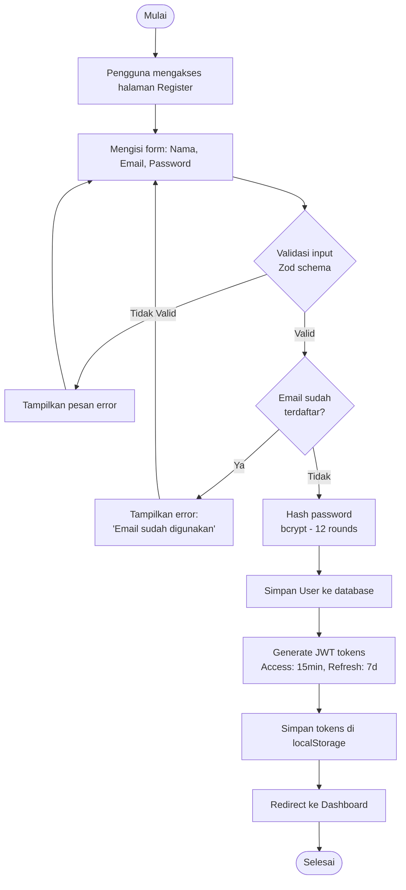

### 13.3 Activity Diagram — Login

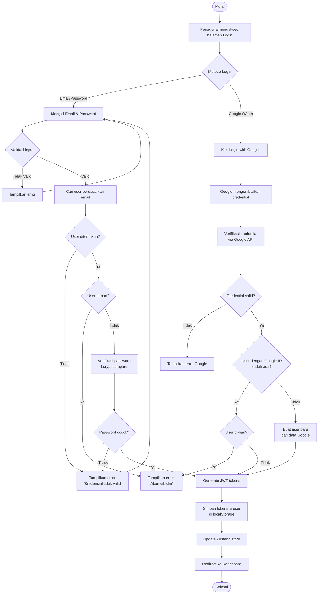

### 13.4 Activity Diagram — Brainstorm AI

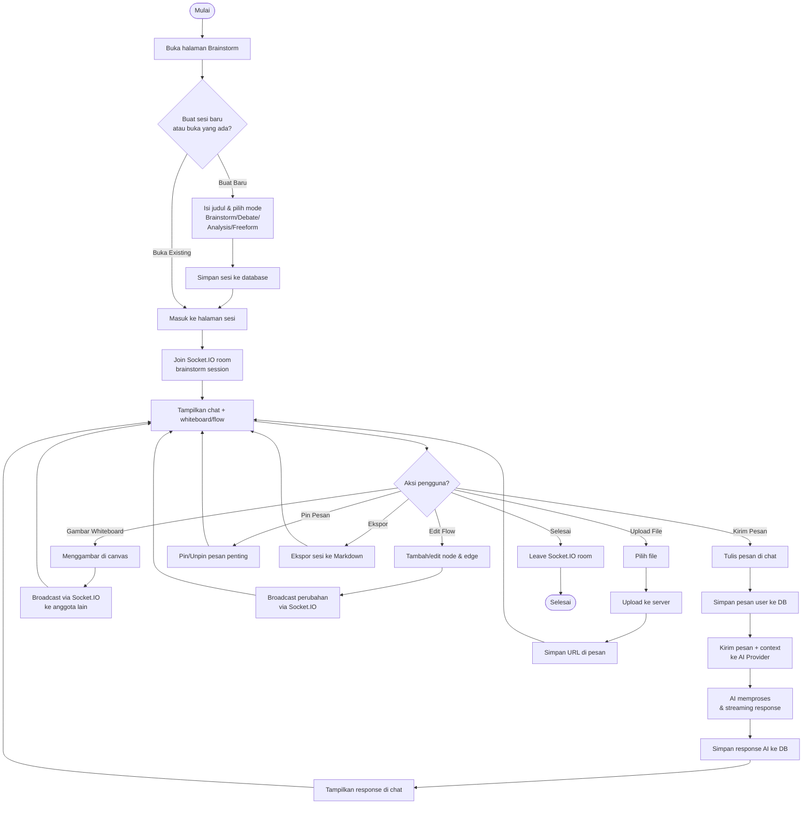

### 13.5 Activity Diagram — Manajemen Task

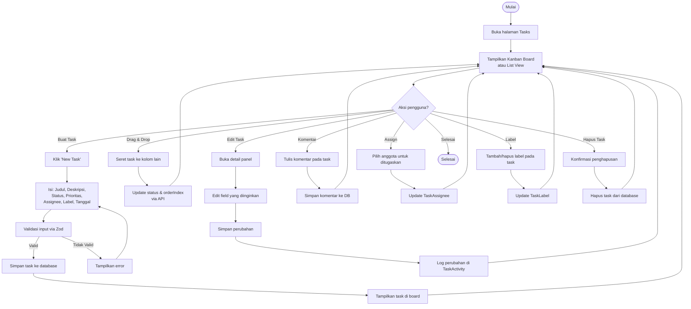

### 13.6 Sequence Diagram — Autentikasi

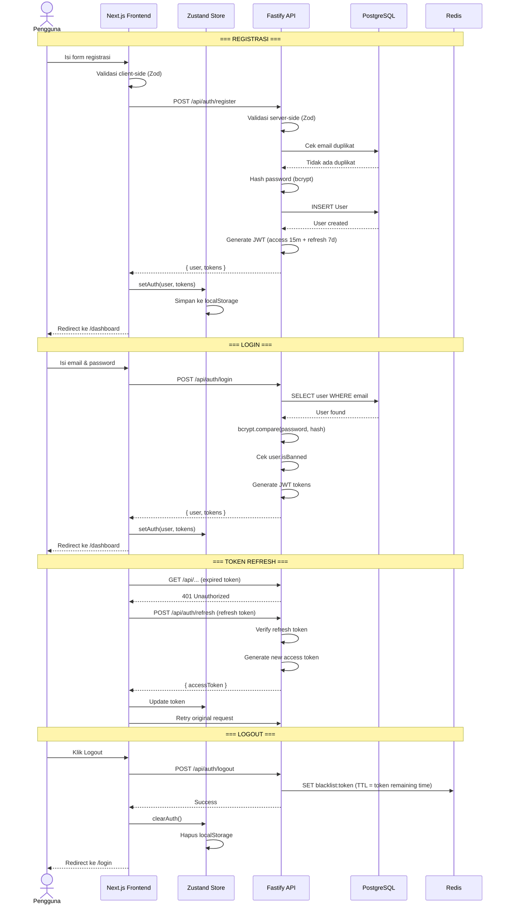

### 13.7 Sequence Diagram — AI Chat

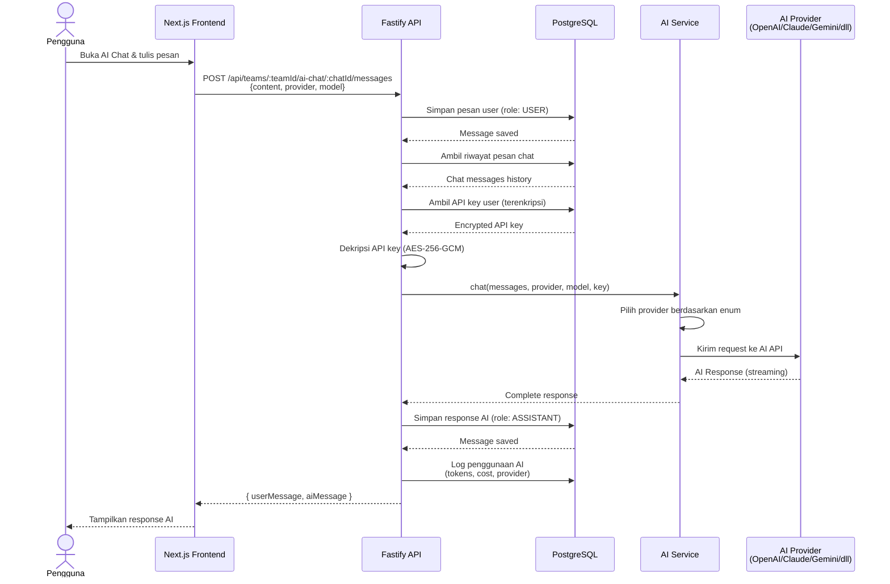

### 13.8 Class Diagram (Database Entity)

```mermaid
classDiagram
    class User {
        +String id
        +String email
        +String? passwordHash
        +String? googleId
        +String name
        +String? avatarUrl
        +Boolean isAdmin
        +Boolean isBanned
        +String? banReason
        +DateTime? bannedAt
        +DateTime createdAt
        +DateTime updatedAt
    }

    class Team {
        +String id
        +String name
        +String? description
        +String ownerId
        +DateTime createdAt
        +DateTime updatedAt
    }

    class TeamMember {
        +String id
        +String teamId
        +String userId
        +TeamRole role
        +DateTime joinedAt
    }

    class TeamInvitation {
        +String id
        +String teamId
        +String email
        +String invitedBy
        +TeamRole role
        +InvitationStatus status
        +String token
        +DateTime expiresAt
        +DateTime createdAt
    }

    class Project {
        +String id
        +String teamId
        +String name
        +String? description
        +String color
        +String icon
        +String createdBy
        +DateTime createdAt
        +DateTime updatedAt
    }

    class ProjectMember {
        +String id
        +String projectId
        +String userId
        +TeamRole role
        +DateTime joinedAt
    }

    class Task {
        +String id
        +String teamId
        +String? projectId
        +String? sprintId
        +String title
        +String? description
        +TaskStatus status
        +TaskPriority priority
        +DateTime? startDate
        +DateTime? dueDate
        +DateTime? completedAt
        +String createdBy
        +Int? estimation
        +Int? timeSpent
        +Int orderIndex
        +DateTime createdAt
        +DateTime updatedAt
    }

    class TaskAssignee {
        +String id
        +String taskId
        +String userId
    }

    class Label {
        +String id
        +String teamId
        +String name
        +String color
    }

    class TaskLabel {
        +String taskId
        +String labelId
    }

    class TaskDependency {
        +String id
        +String dependentTaskId
        +String dependencyTaskId
    }

    class TaskComment {
        +String id
        +String taskId
        +String userId
        +String content
        +DateTime createdAt
        +DateTime updatedAt
    }

    class TaskActivity {
        +String id
        +String taskId
        +String userId
        +String action
        +String? oldValue
        +String? newValue
        +DateTime createdAt
    }

    class UserAIKey {
        +String id
        +String userId
        +AIProviderEnum provider
        +String encryptedKey
        +String? label
        +Boolean isActive
        +DateTime? lastUsedAt
        +DateTime createdAt
        +DateTime updatedAt
    }

    class BrainstormSession {
        +String id
        +String teamId
        +String? projectId
        +String createdBy
        +String title
        +BrainstormMode mode
        +String? context
        +Boolean isActive
        +Json? whiteboardData
        +Json? flowData
        +DateTime createdAt
        +DateTime updatedAt
    }

    class BrainstormMessage {
        +String id
        +String sessionId
        +String? userId
        +MessageRole role
        +String content
        +Boolean isPinned
        +String? fileUrl
        +String? fileName
        +String? fileType
        +Boolean isEdited
        +DateTime createdAt
        +DateTime updatedAt
    }

    class SprintPlan {
        +String id
        +String teamId
        +String? projectId
        +String createdBy
        +String title
        +String goal
        +DateTime deadline
        +Int teamSize
        +SprintStatus status
        +Json data
        +DateTime createdAt
        +DateTime updatedAt
    }

    class Diagram {
        +String id
        +String teamId
        +String? projectId
        +String createdBy
        +String title
        +String? description
        +DiagramType type
        +Json data
        +String? thumbnail
        +DateTime createdAt
        +DateTime updatedAt
    }

    class Note {
        +String id
        +String teamId
        +String? projectId
        +String createdBy
        +String title
        +String content
        +Int version
        +DateTime createdAt
        +DateTime updatedAt
    }

    class NoteHistory {
        +String id
        +String noteId
        +String content
        +Int version
        +String editedBy
        +DateTime createdAt
    }

    class CalendarEvent {
        +String id
        +String teamId
        +String createdBy
        +String title
        +String? description
        +EventType type
        +DateTime startDate
        +DateTime? endDate
        +Boolean allDay
        +String? color
        +DateTime createdAt
        +DateTime updatedAt
    }

    class Goal {
        +String id
        +String teamId
        +String? projectId
        +String createdBy
        +String title
        +String? description
        +GoalStatus status
        +Int progress
        +DateTime? dueDate
        +DateTime createdAt
        +DateTime updatedAt
    }

    class Discussion {
        +String id
        +String teamId
        +String createdBy
        +String title
        +String content
        +String category
        +Boolean isPinned
        +Boolean isClosed
        +DateTime createdAt
        +DateTime updatedAt
    }

    class DiscussionReply {
        +String id
        +String discussionId
        +String userId
        +String content
        +DateTime createdAt
        +DateTime updatedAt
    }

    class AiChat {
        +String id
        +String teamId
        +String? projectId
        +String createdBy
        +String title
        +DateTime createdAt
        +DateTime updatedAt
    }

    class AiChatMessage {
        +String id
        +String chatId
        +MessageRole role
        +String content
        +String? provider
        +String? model
        +DateTime createdAt
    }

    class Notification {
        +String id
        +String teamId
        +String userId
        +String title
        +String? message
        +String type
        +String? link
        +Boolean read
        +DateTime createdAt
    }

    class AIUsageLog {
        +String id
        +String userId
        +String provider
        +String model
        +Int promptTokens
        +Int completionTokens
        +Float estimatedCost
        +String feature
        +DateTime createdAt
    }

    class SystemSetting {
        +String id
        +String category
        +String key
        +String value
        +String type
        +String? label
        +DateTime updatedAt
        +DateTime createdAt
    }

    %% Relationships
    User "1" --> "*" Team : owns
    User "1" --> "*" TeamMember : memberships
    Team "1" --> "*" TeamMember : members
    Team "1" --> "*" TeamInvitation : invitations
    User "1" --> "*" TeamInvitation : sent
    
    Team "1" --> "*" Project : projects
    User "1" --> "*" Project : created
    Project "1" --> "*" ProjectMember : members
    User "1" --> "*" ProjectMember : memberships

    Team "1" --> "*" Task : tasks
    Project "1" --> "*" Task : tasks
    SprintPlan "1" --> "*" Task : tasks
    User "1" --> "*" Task : created
    Task "1" --> "*" TaskAssignee : assignees
    User "1" --> "*" TaskAssignee : assignments
    Task "1" --> "*" TaskLabel : labels
    Label "1" --> "*" TaskLabel : tasks
    Team "1" --> "*" Label : labels
    Task "1" --> "*" TaskComment : comments
    User "1" --> "*" TaskComment : comments
    Task "1" --> "*" TaskActivity : activities
    Task "1" --> "*" TaskDependency : dependencies

    User "1" --> "*" UserAIKey : aiKeys
    User "1" --> "*" AIUsageLog : usageLogs

    Team "1" --> "*" BrainstormSession : sessions
    Project "1" --> "*" BrainstormSession : sessions
    User "1" --> "*" BrainstormSession : created
    BrainstormSession "1" --> "*" BrainstormMessage : messages
    User "1" --> "*" BrainstormMessage : messages

    Team "1" --> "*" SprintPlan : sprints
    Project "1" --> "*" SprintPlan : sprints
    User "1" --> "*" SprintPlan : created

    Team "1" --> "*" Diagram : diagrams
    Project "1" --> "*" Diagram : diagrams
    User "1" --> "*" Diagram : created

    Team "1" --> "*" Note : notes
    Project "1" --> "*" Note : notes
    User "1" --> "*" Note : created
    Note "1" --> "*" NoteHistory : history
    User "1" --> "*" NoteHistory : edited

    Team "1" --> "*" CalendarEvent : events
    User "1" --> "*" CalendarEvent : created

    Team "1" --> "*" Goal : goals
    Project "1" --> "*" Goal : goals
    User "1" --> "*" Goal : created

    Team "1" --> "*" Discussion : discussions
    User "1" --> "*" Discussion : created
    Discussion "1" --> "*" DiscussionReply : replies
    User "1" --> "*" DiscussionReply : replies

    Team "1" --> "*" AiChat : chats
    Project "1" --> "*" AiChat : chats
    User "1" --> "*" AiChat : created
    AiChat "1" --> "*" AiChatMessage : messages

    Team "1" --> "*" Notification : notifications
    User "1" --> "*" Notification : notifications
```

### 13.9 Class Diagram — AI Provider

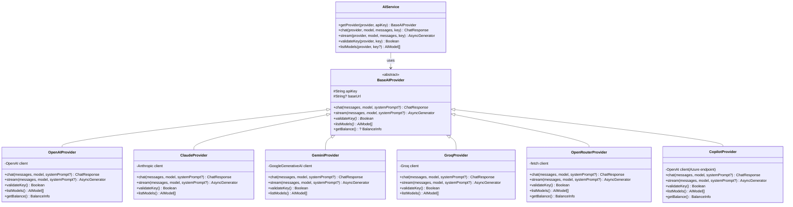

### 13.10 Component Diagram

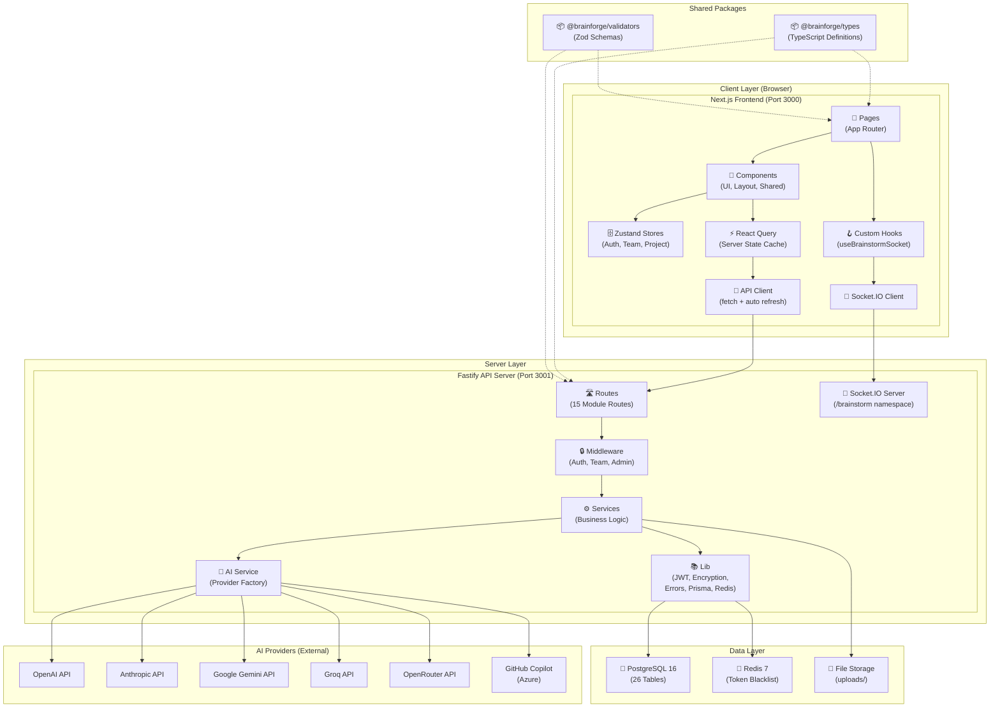

### 13.11 Deployment Diagram

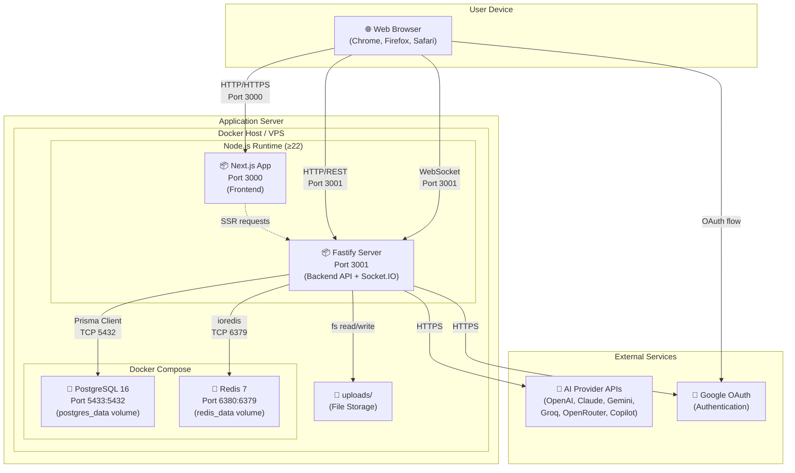

### 13.12 Navigation Diagram (Sitemap)

```mermaid
graph TD
    Landing["🏠 Landing Page<br/>(/)"]
    
    subgraph "Auth Pages"
        Login["🔐 Login<br/>(/login)"]
        Register["📝 Register<br/>(/register)"]
        ForgotPW["❓ Forgot Password<br/>(/forgot-password)"]
        ResetPW["🔄 Reset Password<br/>(/reset-password)"]
        JoinTeam["👋 Join Team<br/>(/join/[token])"]
    end
    
    subgraph "Main App (Sidebar Layout)"
        Dashboard["📊 Dashboard<br/>(/dashboard)"]
        
        subgraph "Project Management"
            Projects["📁 Projects<br/>(/projects)"]
            Tasks["📋 Tasks<br/>(/tasks)"]
            Sprints["⚡ Sprints<br/>(/sprints)"]
            Goals["🎯 Goals<br/>(/goals)"]
            Calendar["📅 Calendar<br/>(/calendar)"]
        end
        
        subgraph "AI & Collaboration"
            Brainstorm["💬 Brainstorm<br/>(/brainstorm)"]
            BrainstormSession["💬 Session<br/>(/brainstorm/[id])"]
            AIChat["🤖 AI Chat<br/>(/ai-chat)"]
            Diagrams["🔀 Diagrams<br/>(/diagrams)"]
            Notes["📝 Notes<br/>(/notes)"]
            Discussions["💬 Discussions<br/>(in development)"]
        end
        
        subgraph "Communication"
            Notifications["🔔 Notifications<br/>(/notifications)"]
        end
        
        subgraph "Settings"
            GeneralSettings["⚙️ Settings<br/>(/settings)"]
            AIKeySettings["🔑 AI Keys<br/>(/settings/ai-keys)"]
            TeamSettings["👥 Team<br/>(/settings/team)"]
        end
        
        Docs["📖 Docs<br/>(/docs)"]
    end
    
    subgraph "Admin Panel"
        AdminDashboard["📊 Admin Dashboard<br/>(/admin)"]
        AdminUsers["👤 Users<br/>(/admin/users)"]
        AdminTeams["👥 Teams<br/>(/admin/teams)"]
        AdminActivity["📈 Activity<br/>(/admin/activity)"]
        AdminAIUsage["🤖 AI Usage<br/>(/admin/ai-usage)"]
        AdminAPIKeys["🔑 API Keys<br/>(/admin/api-keys)"]
        AdminSettings["⚙️ Settings<br/>(/admin/settings)"]
        AdminSystem["🖥️ System<br/>(/admin/system)"]
    end

    Landing -->|"Login"| Login
    Landing -->|"Register"| Register
    Login -->|"Forgot?"| ForgotPW
    ForgotPW -->|"Reset"| ResetPW
    Login -->|"Success"| Dashboard
    Register -->|"Success"| Dashboard
    JoinTeam -->|"Accepted"| Dashboard
    
    Dashboard --> Projects
    Dashboard --> Tasks
    Dashboard --> Brainstorm
    Dashboard --> Diagrams
    Dashboard --> Sprints
    Dashboard --> Notes
    Dashboard --> Calendar
    Dashboard --> Goals
    Dashboard --> AIChat
    Dashboard --> Notifications
    Dashboard --> GeneralSettings
    Dashboard --> Docs
    
    Brainstorm --> BrainstormSession
    GeneralSettings --> AIKeySettings
    GeneralSettings --> TeamSettings
    
    Dashboard -->|"Admin Only"| AdminDashboard
    AdminDashboard --> AdminUsers
    AdminDashboard --> AdminTeams
    AdminDashboard --> AdminActivity
    AdminDashboard --> AdminAIUsage
    AdminDashboard --> AdminAPIKeys
    AdminDashboard --> AdminSettings
    AdminDashboard --> AdminSystem
```

### 13.13 Entity Relationship Diagram (ERD)

```mermaid
erDiagram
    User ||--o{ Team : "owns"
    User ||--o{ TeamMember : "has"
    User ||--o{ TeamInvitation : "sends"
    User ||--o{ UserAIKey : "has"
    User ||--o{ Task : "creates"
    User ||--o{ TaskAssignee : "assigned to"
    User ||--o{ TaskComment : "writes"
    User ||--o{ BrainstormSession : "creates"
    User ||--o{ BrainstormMessage : "sends"
    User ||--o{ Note : "creates"
    User ||--o{ NoteHistory : "edits"
    User ||--o{ Diagram : "creates"
    User ||--o{ CalendarEvent : "creates"
    User ||--o{ SprintPlan : "creates"
    User ||--o{ Discussion : "creates"
    User ||--o{ DiscussionReply : "writes"
    User ||--o{ Goal : "creates"
    User ||--o{ Notification : "receives"
    User ||--o{ AIUsageLog : "generates"
    User ||--o{ AiChat : "creates"
    User ||--o{ Project : "creates"
    User ||--o{ ProjectMember : "member of"

    Team ||--o{ TeamMember : "has"
    Team ||--o{ TeamInvitation : "has"
    Team ||--o{ Project : "has"
    Team ||--o{ Task : "has"
    Team ||--o{ BrainstormSession : "has"
    Team ||--o{ SprintPlan : "has"
    Team ||--o{ Note : "has"
    Team ||--o{ Diagram : "has"
    Team ||--o{ CalendarEvent : "has"
    Team ||--o{ Label : "has"
    Team ||--o{ Discussion : "has"
    Team ||--o{ Goal : "has"
    Team ||--o{ Notification : "has"
    Team ||--o{ AiChat : "has"

    Project ||--o{ ProjectMember : "has"
    Project ||--o{ Task : "contains"
    Project ||--o{ BrainstormSession : "contains"
    Project ||--o{ SprintPlan : "contains"
    Project ||--o{ Note : "contains"
    Project ||--o{ Diagram : "contains"
    Project ||--o{ Goal : "contains"
    Project ||--o{ AiChat : "contains"

    Task ||--o{ TaskAssignee : "has"
    Task ||--o{ TaskLabel : "has"
    Task ||--o{ TaskComment : "has"
    Task ||--o{ TaskActivity : "has"
    Task ||--o{ TaskDependency : "depends on"

    Label ||--o{ TaskLabel : "applied to"
    SprintPlan ||--o{ Task : "contains"
    
    BrainstormSession ||--o{ BrainstormMessage : "has"
    Note ||--o{ NoteHistory : "has"
    Discussion ||--o{ DiscussionReply : "has"
    AiChat ||--o{ AiChatMessage : "has"

    User {
        string id PK
        string email UK
        string passwordHash
        string googleId UK
        string name
        string avatarUrl
        boolean isAdmin
        boolean isBanned
        datetime createdAt
    }

    Team {
        string id PK
        string name
        string description
        string ownerId FK
        datetime createdAt
    }

    TeamMember {
        string id PK
        string teamId FK
        string userId FK
        enum role
        datetime joinedAt
    }

    Project {
        string id PK
        string teamId FK
        string name
        string description
        string color
        string icon
        string createdBy FK
    }

    Task {
        string id PK
        string teamId FK
        string projectId FK
        string sprintId FK
        string title
        string description
        enum status
        enum priority
        datetime dueDate
        string createdBy FK
        int estimation
        int orderIndex
    }

    BrainstormSession {
        string id PK
        string teamId FK
        string projectId FK
        string createdBy FK
        string title
        enum mode
        string context
        boolean isActive
        json whiteboardData
        json flowData
    }

    BrainstormMessage {
        string id PK
        string sessionId FK
        string userId FK
        enum role
        string content
        boolean isPinned
        string fileUrl
    }

    SprintPlan {
        string id PK
        string teamId FK
        string projectId FK
        string createdBy FK
        string title
        string goal
        datetime deadline
        int teamSize
        enum status
        json data
    }

    Diagram {
        string id PK
        string teamId FK
        string projectId FK
        string createdBy FK
        string title
        enum type
        json data
    }

    Note {
        string id PK
        string teamId FK
        string projectId FK
        string createdBy FK
        string title
        string content
        int version
    }

    NoteHistory {
        string id PK
        string noteId FK
        string content
        int version
        string editedBy FK
    }

    CalendarEvent {
        string id PK
        string teamId FK
        string createdBy FK
        string title
        enum type
        datetime startDate
        datetime endDate
        boolean allDay
    }

    Goal {
        string id PK
        string teamId FK
        string projectId FK
        string createdBy FK
        string title
        enum status
        int progress
        datetime dueDate
    }

    Discussion {
        string id PK
        string teamId FK
        string createdBy FK
        string title
        string content
        string category
        boolean isPinned
        boolean isClosed
    }

    DiscussionReply {
        string id PK
        string discussionId FK
        string userId FK
        string content
    }

    AiChat {
        string id PK
        string teamId FK
        string projectId FK
        string createdBy FK
        string title
    }

    AiChatMessage {
        string id PK
        string chatId FK
        enum role
        string content
        string provider
        string model
    }

    UserAIKey {
        string id PK
        string userId FK
        enum provider
        string encryptedKey
        boolean isActive
    }

    AIUsageLog {
        string id PK
        string userId FK
        string provider
        string model
        int promptTokens
        int completionTokens
        float estimatedCost
        string feature
    }

    Notification {
        string id PK
        string teamId FK
        string userId FK
        string title
        string message
        string type
        boolean read
    }

    SystemSetting {
        string id PK
        string category
        string key
        string value
        string type
    }

    Label {
        string id PK
        string teamId FK
        string name
        string color
    }

    TaskAssignee {
        string id PK
        string taskId FK
        string userId FK
    }

    TaskLabel {
        string taskId FK
        string labelId FK
    }

    TaskDependency {
        string id PK
        string dependentTaskId FK
        string dependencyTaskId FK
    }

    TaskComment {
        string id PK
        string taskId FK
        string userId FK
        string content
    }

    TaskActivity {
        string id PK
        string taskId FK
        string userId
        string action
        string oldValue
        string newValue
    }

    TeamInvitation {
        string id PK
        string teamId FK
        string email
        string invitedBy FK
        enum role
        enum status
        string token UK
        datetime expiresAt
    }

    ProjectMember {
        string id PK
        string projectId FK
        string userId FK
        enum role
    }
```

---

## 14. State Management

### 14.1 Zustand Stores (Client-side State)

| Store | Key State | Deskripsi |
|-------|-----------|-----------|
| `useAuthStore` | `user`, `tokens`, `isAuthenticated` | Menyimpan data autentikasi. Persistensi via localStorage (`brainforge_tokens`, `brainforge_user`). Menangani hidrasi JWT, pengecekan expiry, login/logout. |
| `useTeamStore` | `teams`, `activeTeam` | Menyimpan pilihan tim aktif. Persisten ke localStorage. Otomatis memilih tim pertama. |
| `useProjectStore` | `projects`, `activeProject` | Menyimpan pilihan proyek aktif dalam tim. Persisten ke localStorage. Melacak jumlah (tasks, sessions, diagrams, goals). |

### 14.2 Server State (React Query)

TanStack React Query digunakan untuk:
- **Data fetching** — Mengambil data dari API
- **Caching** — Menyimpan cache response API
- **Background refetching** — Memperbarui data secara otomatis
- **Optimistic updates** — Update UI sebelum respons server (misalnya drag & drop task)
- **Query invalidation** — Menghapus cache setelah mutation (buat/update/hapus)

---

## 15. Middleware & Keamanan

### 15.1 Rantai Middleware (Middleware Chain)

| Middleware | Deskripsi | Letak |
|------------|-----------|-------|
| **`authGuard`** | Memvalidasi Bearer JWT token, mengecek blacklist di Redis, memverifikasi user ada dan tidak di-ban. Menambahkan `request.user`. | Semua route yang memerlukan autentikasi |
| **`teamGuard(requiredRoles?)`** | Memverifikasi user adalah anggota tim dari `teamId` di URL params. Opsional memeriksa role (OWNER/ADMIN/MEMBER). Menambahkan `request.teamMember`. | Route yang terkait tim |
| **`adminGuard`** | Memverifikasi `user.isAdmin === true` dari database. | Route admin |

### 15.2 Contoh Penggunaan Middleware

| Tipe Route | Middleware Chain |
|------------|-----------------|
| Route publik | Tidak ada middleware |
| Route autentikasi saja | `authGuard` |
| Route tim | `authGuard` → `teamGuard()` |
| Route admin | `authGuard` → `adminGuard` |
| Route dengan role tertentu | `authGuard` → `teamGuard(['OWNER', 'ADMIN'])` |

### 15.3 Fitur Keamanan

| Fitur | Implementasi |
|-------|-------------|
| **Enkripsi Password** | bcrypt dengan 12 salt rounds |
| **JWT Token** | HS256 via library `jose`, access token 15 menit, refresh token 7 hari |
| **Token Blacklisting** | Redis menyimpan token yang sudah di-logout |
| **Enkripsi API Key** | AES-256-GCM menggunakan `ENCRYPTION_KEY` dari environment variable |
| **CORS** | Dikonfigurasi via `@fastify/cors` |
| **HTTP Security Headers** | Via `@fastify/helmet` |
| **Rate Limiting** | Via `@fastify/rate-limit` |
| **Input Validation** | Zod schema di server-side dan client-side |
| **Ban System** | Admin dapat ban user, `authGuard` menolak user yang di-ban dengan 403 |

---

## 16. Infrastruktur & Deployment

### 16.1 Persyaratan Sistem

| Komponen | Minimum | Direkomendasikan |
|----------|---------|-----------------|
| **Node.js** | ≥ 22.0.0 | Latest LTS |
| **pnpm** | ≥ 9.0.0 | 9.15.0 |
| **PostgreSQL** | 15+ | 16 |
| **Redis** | 7+ | 7-alpine |
| **RAM** | 2 GB | 4 GB |
| **Disk** | 10 GB | 20 GB |

### 16.2 Environment Variables

| Variable | Deskripsi |
|----------|-----------|
| `DATABASE_URL` | Connection string PostgreSQL |
| `REDIS_URL` | Connection string Redis |
| `JWT_SECRET` | Secret key untuk JWT signing |
| `ENCRYPTION_KEY` | Key untuk enkripsi AES-256-GCM (API keys) |
| `GOOGLE_CLIENT_ID` | Google OAuth Client ID |
| `CORS_ORIGIN` | Allowed CORS origins |

### 16.3 Docker Compose

```yaml
services:
  postgres:
    image: postgres:16-alpine
    ports: ['5433:5432']
    volumes: [postgres_data:/var/lib/postgresql/data]

  redis:
    image: redis:7-alpine
    ports: ['6380:6379']
    volumes: [redis_data:/data]
```

### 16.4 Monorepo Build Pipeline (Turborepo)

```
pnpm dev       → Menjalankan semua app dalam mode development
pnpm build     → Build semua packages dan apps
pnpm lint      → Linting semua packages
pnpm db:migrate → Menjalankan database migration (Prisma)
pnpm db:push   → Push schema ke database
pnpm db:studio → Membuka Prisma Studio (GUI database)
pnpm db:seed   → Menjalankan database seeder
```

---

## Lampiran

### A. Daftar File Konfigurasi Penting

| File | Deskripsi |
|------|-----------|
| `package.json` (root) | Konfigurasi monorepo & scripts |
| `pnpm-workspace.yaml` | Definisi workspace pnpm |
| `turbo.json` | Pipeline build Turborepo |
| `docker-compose.yml` | Orkestrasi container PostgreSQL & Redis |
| `apps/api/prisma/schema.prisma` | Schema database lengkap (26 model) |
| `apps/api/tsconfig.json` | Konfigurasi TypeScript backend |
| `apps/web/tsconfig.json` | Konfigurasi TypeScript frontend |
| `apps/web/next.config.mjs` | Konfigurasi Next.js |
| `apps/web/postcss.config.mjs` | Konfigurasi PostCSS + Tailwind |

### B. Ringkasan Kuantitatif

| Metrik | Jumlah |
|--------|--------|
| Total model database | 26 |
| Total enum database | 11 |
| Total modul API | 15 |
| Total API endpoint | ~120+ |
| Total halaman web | ~30+ |
| Total AI provider | 6 |
| Total Zustand store | 3 |
| Total middleware | 3 |
| Total shared packages | 2 |
| Backend dependencies | 20+ |
| Frontend dependencies | 25+ |

---

> **Dokumen ini dibuat untuk keperluan skripsi/penulisan ilmiah. Semua informasi diambil langsung dari source code proyek BrainForge.**
