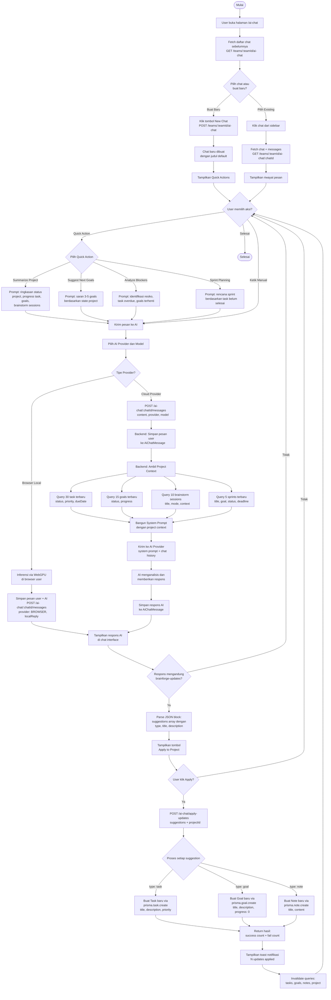

# Activity Diagram — AI Chat Project Analysis

[← Kembali ke Daftar Diagram](../README.md#diagram-uml-file-terpisah)

---

> Fitur **AI Chat** adalah asisten AI yang **menganalisis project** secara real-time. AI membaca konteks project (tasks, goals, brainstorm sessions, sprints) lalu membantu user untuk mengembangkan dan menambahkan task baru, notes, goals, dan lainnya langsung dari percakapan AI.



---

### Penjelasan Alur

| Langkah | Deskripsi |
|---------|-----------|
| 1 | User membuka halaman `/ai-chat` dan melihat daftar chat sebelumnya di sidebar |
| 2 | User bisa membuat chat baru atau melanjutkan chat yang sudah ada |
| 3 | Saat chat baru, ditampilkan **4 Quick Actions**: Summarize Project, Suggest Next Goals, Analyze Blockers, Sprint Planning |
| 4 | User mengirim pesan (via Quick Action atau manual) beserta pilihan AI Provider dan Model |
| 5 | Backend menyimpan pesan user, lalu mengambil **Project Context** dari database |
| 6 | Project Context berisi: 30 task terbaru, 15 goals, 10 brainstorm sessions, 5 sprints |
| 7 | AI menerima system prompt + project context + chat history, lalu menganalisis dan merespons |
| 8 | Jika AI menyarankan perubahan konkret, respons berisi blok `brainforge-updates` JSON |
| 9 | User dapat menekan **Apply to Project** untuk langsung membuat task, goal, atau note baru |
| 10 | Sistem memproses setiap suggestion dan membuat entitas baru di database |

### System Prompt AI

AI menerima system prompt khusus yang berisi:

```
You are BrainForge AI Assistant — a smart project management helper.
You have access to the current project/workspace context below.

=== PROJECT CONTEXT ===
TASKS (30 recent): status summary + detail per task
GOALS (15): status, progress %, description
BRAINSTORM SESSIONS (10 recent): title, mode, context
SPRINTS (5): status, title, goal, deadline
=== END CONTEXT ===

Guidelines:
- Be concise and actionable
- Highlight key progress, blockers, and upcoming work
- Suggest goals based on task statuses and team activity
- Analyze incomplete tasks, goals, and recent brainstorm sessions
```

### Format Project Updates (brainforge-updates)

Ketika AI mengidentifikasi item yang bisa ditindaklanjuti, AI menyertakan blok JSON:

```json
{
  "suggestions": [
    {
      "type": "task",
      "title": "Implementasi fitur notifikasi",
      "description": "Buat sistem notifikasi real-time",
      "priority": "HIGH",
      "status": "TODO"
    },
    {
      "type": "goal",
      "title": "Tingkatkan test coverage ke 80%",
      "description": "Tulis unit test untuk semua service"
    },
    {
      "type": "note",
      "title": "Catatan arsitektur microservice",
      "content": "Pertimbangkan untuk memisahkan AI service..."
    }
  ],
  "summary": "3 suggestions berdasarkan analisis task yang overdue"
}
```

### Quick Actions

| Quick Action | Deskripsi | Ikon |
|-------------|-----------|------|
| **Summarize Project** | Ringkasan komprehensif status project: progress task, goals, brainstorm | BarChart3 |
| **Suggest Next Goals** | Saran 3-5 goals prioritas berdasarkan state project saat ini | Target |
| **Analyze Blockers** | Identifikasi resiko, task overdue, goals terhenti, dan solusinya | Sparkles |
| **Sprint Planning** | Rencana sprint berikutnya berdasarkan task belum selesai dan prioritas | Clock |

### Apply Updates Flow

| Tipe | Aksi | Data yang Dibuat |
|------|------|-----------------|
| **task** | `prisma.task.create()` | title, description, priority, status, projectId, teamId |
| **goal** | `prisma.goal.create()` | title, description, status: NOT_STARTED, progress: 0, projectId |
| **note** | `prisma.note.create()` | title, content, projectId, teamId |

### Fitur Tambahan

| Fitur | Deskripsi |
|-------|-----------|
| **Multi-Provider** | Mendukung semua 6 provider cloud + Browser local (WebGPU) |
| **Model Selection** | Kategori otomatis: GPT, Claude, Gemini, Reasoning, Meta, DeepSeek, Mistral, Qwen |
| **Browser Inference** | Inferensi lokal via WebGPU tanpa API key, model di-download ke browser |
| **Chat History** | Riwayat semua percakapan tersimpan per team, bisa di-rename dan dihapus |
| **Project Context** | AI membaca data project secara real-time setiap kali user mengirim pesan |
| **Auto-create Chat** | Chat otomatis dibuat jika user mengirim pesan tanpa chat aktif |

---

[← Kembali ke Daftar Diagram](../README.md#diagram-uml-file-terpisah)
