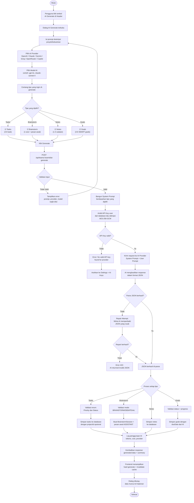

# Activity Diagram — AI Generate (Bulk Generation)

[← Kembali ke Daftar Diagram](../README.md#diagram-uml-file-terpisah)

---

> Fitur AI Generate memungkinkan pengguna membuat **Tasks, Brainstorm Session, Notes, dan Goals** sekaligus dari satu prompt menggunakan AI.



---

### Penjelasan Alur

| Langkah | Deskripsi |
|---------|-----------|
| 1 | Pengguna membuka dialog AI Generate melalui tombol di header aplikasi |
| 2 | Mengisi prompt yang mendeskripsikan apa yang ingin di-generate |
| 3 | Memilih AI provider (6 pilihan) dan model spesifik |
| 4 | Mencentang tipe konten yang ingin di-generate (bisa multiple): Tasks, Brainstorm, Notes, Goals |
| 5 | Frontend mengirim request ke endpoint `POST /api/teams/:teamId/ai-generate` |
| 6 | Server memvalidasi input dan membangun system prompt yang strict berdasarkan tipe yang dipilih |
| 7 | Server mengambil dan mendekripsi API key pengguna (BYOK — AES-256-GCM) |
| 8 | Request dikirim ke AI provider yang dipilih |
| 9 | AI menghasilkan response dalam format JSON strict |
| 10 | Jika JSON gagal di-parse, dilakukan **repair attempt** (minta AI memperbaiki output-nya sendiri) |
| 11 | JSON yang berhasil di-parse diproses per tipe: setiap item divalidasi enum-nya lalu disimpan ke database |
| 12 | Penggunaan AI di-log (token count, estimated cost) |
| 13 | Response berisi data yang di-generate + summary jumlah item yang berhasil dibuat |

### Detail Tipe Generate

| Tipe | Output AI | Validasi | Disimpan Sebagai |
|------|-----------|----------|-----------------|
| **Tasks** | 3-8 task dengan title, description, priority, status | Priority: URGENT/HIGH/MEDIUM/LOW, Status: default TODO | `Task` model di database |
| **Brainstorm** | 1 sesi dengan title, mode, dan initialMessage | Mode: BRAINSTORM/DEBATE/ANALYSIS/FREEFORM | `BrainstormSession` + `BrainstormMessage` awal |
| **Notes** | 1-3 catatan dengan title dan content terstruktur | Validasi title max 200 chars | `Note` model di database |
| **Goals** | 3-6 SMART goals dengan title, description, status, progress, dueDate | Status: NOT_STARTED, Progress: 0-100, DueDate: ISO 8601 | `Goal` model di database |

### Fitur Khusus

- **System Prompt Dinamis:** System prompt dibangun secara dinamis berdasarkan tipe yang dipilih, hanya menyertakan schema yang relevan
- **JSON Repair:** Jika AI menghasilkan JSON yang rusak, sistem otomatis meminta AI memperbaikinya (repair attempt)
- **Markdown Fence Stripping:** Parser otomatis menghapus code fences (` ```json `) dari output AI
- **Enum Safety:** Setiap nilai enum dari AI divalidasi terhadap set yang valid, dengan fallback ke default value

---

[← Kembali ke Daftar Diagram](../README.md#diagram-uml-file-terpisah)
