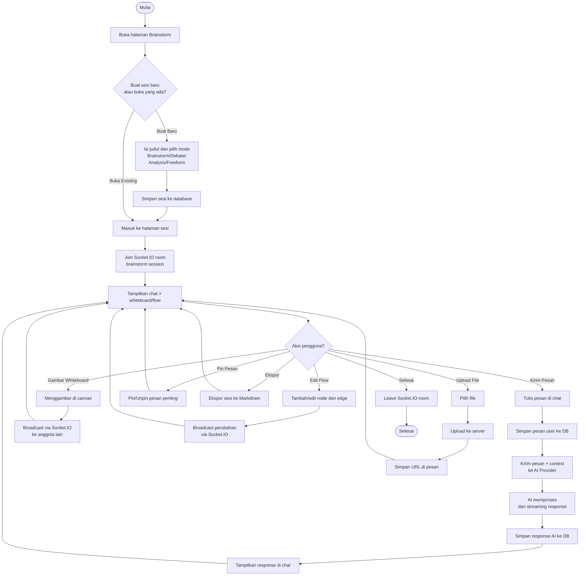

# Activity Diagram — Brainstorm AI

[← Kembali ke Daftar Diagram](../README.md#diagram-uml-file-terpisah)

---

---

### Penjelasan Alur

| Langkah | Deskripsi |
|---------|-----------|
| 1 | Pengguna membuka halaman `/brainstorm` |
| 2 | Memilih untuk membuat sesi baru atau membuka sesi yang sudah ada |
| 3 | Untuk sesi baru: isi judul dan pilih mode (Brainstorm, Debate, Analysis, Freeform) |
| 4 | Saat masuk ke sesi, client bergabung ke Socket.IO room untuk kolaborasi real-time |
| 5 | Pengguna dapat melakukan berbagai aksi: mengirim pesan, menggambar whiteboard, mengedit flow, upload file, pin pesan, atau ekspor |
| 6 | Saat mengirim pesan, AI memproses dan menghasilkan respons yang disimpan ke database |
| 7 | Aksi whiteboard dan flow di-broadcast ke anggota lain via Socket.IO |
| 8 | Saat selesai, client keluar dari Socket.IO room |

---

[← Kembali ke Daftar Diagram](../README.md#diagram-uml-file-terpisah)
