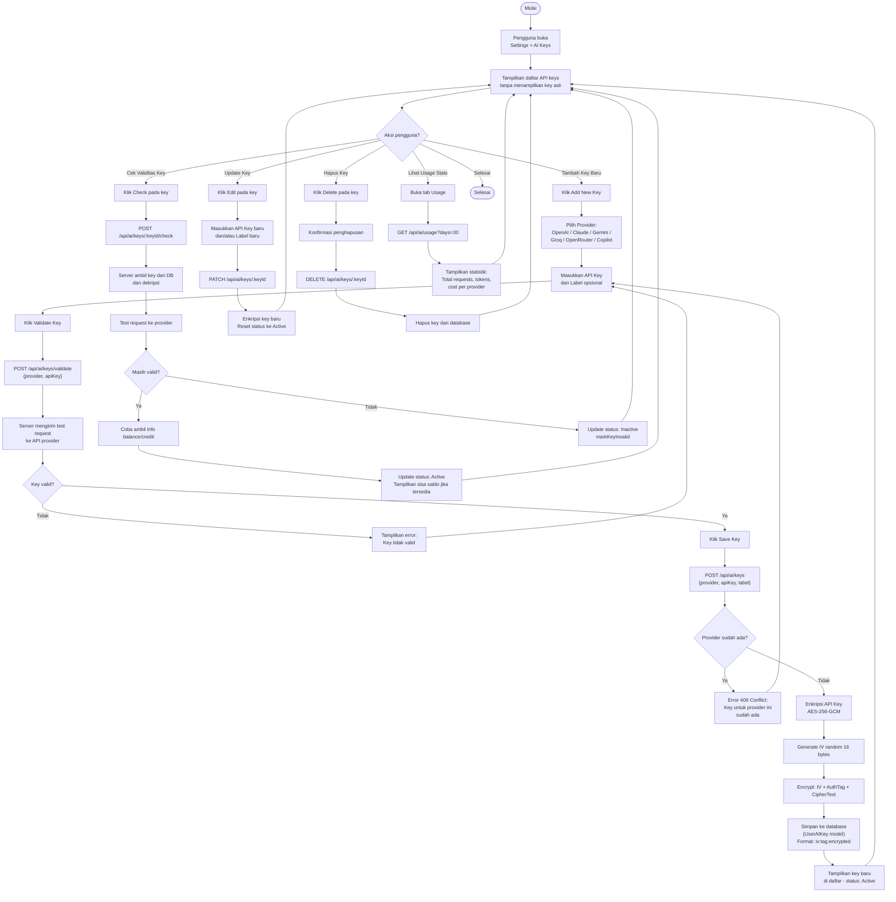
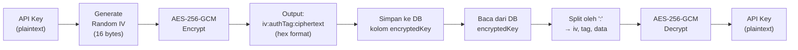

# Activity Diagram — BYOK (Bring Your Own Key) Management

[← Kembali ke Daftar Diagram](../README.md#diagram-uml-file-terpisah)

---

> BYOK (Bring Your Own Key) adalah model di mana pengguna menyediakan API key AI mereka sendiri. Key disimpan terenkripsi menggunakan **AES-256-GCM** dan tidak pernah dikirim kembali ke frontend.

---

### Penjelasan Alur

#### Tambah Key Baru
| Langkah | Deskripsi |
|---------|-----------|
| 1 | Pengguna membuka halaman `/settings/ai-keys` |
| 2 | Memilih provider AI (6 pilihan tersedia) |
| 3 | Memasukkan API key dan label opsional |
| 4 | Sebelum menyimpan, key divalidasi dengan mengirim test request ke API provider |
| 5 | Jika valid, key dienkripsi dengan AES-256-GCM dan disimpan ke database |
| 6 | Satu user hanya boleh punya satu key per provider (conflict jika duplikat) |

#### Cek Validitas Key (Check)
| Langkah | Deskripsi |
|---------|-----------|
| 1 | Server mengambil key yang tersimpan dan mendekripsinya |
| 2 | Mengirim test request ke provider untuk validasi |
| 3 | Jika provider mendukung, mengambil info balance/credit |
| 4 | Status key diupdate (Active/Inactive) berdasarkan hasil |

#### Alur Enkripsi API Key

---

### Detail Keamanan BYOK

| Aspek | Implementasi |
|-------|-------------|
| **Algoritma Enkripsi** | AES-256-GCM (Authenticated Encryption) |
| **Key Size** | 256-bit (32 bytes dari hex string 64 karakter) |
| **IV (Initialization Vector)** | Random 16 bytes, di-generate untuk setiap enkripsi |
| **Authentication Tag** | GCM auth tag untuk memastikan integritas data |
| **Format Penyimpanan** | `iv:authTag:ciphertext` (hex-encoded, dipisah colon) |
| **Encryption Key** | Disimpan di environment variable `ENCRYPTION_KEY` |
| **Key Tidak Pernah Dikirim ke Client** | API hanya mengembalikan `id`, `provider`, `label`, `isActive`, `lastUsedAt` |
| **Auto-Invalidation** | Key otomatis ditandai inactive jika request ke provider gagal |
| **One Key Per Provider** | Satu user hanya boleh menyimpan satu key per provider |

### API Endpoints BYOK

| Method | Endpoint | Deskripsi |
|--------|----------|-----------|
| `GET` | `/api/ai/keys` | Daftar semua key user (tanpa key asli) |
| `POST` | `/api/ai/keys` | Tambah key baru (enkripsi + simpan) |
| `PATCH` | `/api/ai/keys/:keyId` | Update key atau label |
| `DELETE` | `/api/ai/keys/:keyId` | Hapus key |
| `POST` | `/api/ai/keys/validate` | Validasi key sebelum menyimpan |
| `POST` | `/api/ai/keys/:keyId/check` | Cek validitas key tersimpan + balance |
| `GET` | `/api/ai/usage?days=30` | Statistik penggunaan AI |

### Provider yang Didukung

| Provider | SDK | Balance Check | Deskripsi |
|----------|-----|:-------------:|-----------|
| **OpenAI** | `openai` | ✅ | GPT-4.1, GPT-4o, GPT-4o-mini, dll. |
| **Anthropic Claude** | `@anthropic-ai/sdk` | ❌ | Claude Sonnet 4, Opus 4, Haiku, dll. |
| **Google Gemini** | `@google/generative-ai` | ❌ | Gemini 2.5 Flash, 2.5 Pro, dll. |
| **Groq** | `groq-sdk` | ❌ | Llama 3, Mixtral (inferensi cepat) |
| **OpenRouter** | `fetch` (API compatible) | ✅ | 400+ model dari berbagai provider |
| **GitHub Copilot** | `openai` (Azure endpoint) | ✅ | Via Azure OpenAI endpoint |

---

[← Kembali ke Daftar Diagram](../README.md#diagram-uml-file-terpisah)
