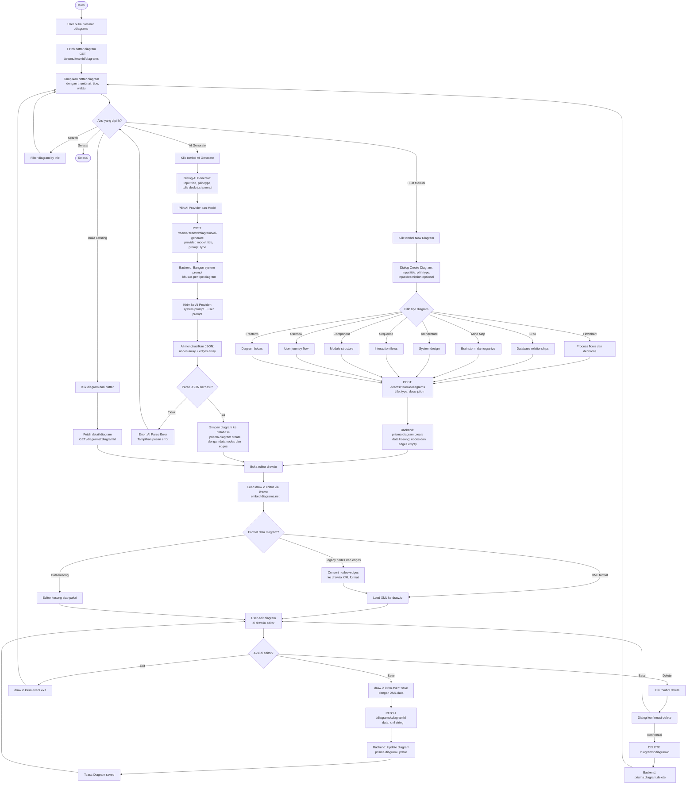

# Activity Diagram — Diagram (AI-Powered Diagramming)

[← Kembali ke Daftar Diagram](../README.md#diagram-uml-file-terpisah)

---

> Fitur **Diagram** memungkinkan user membuat diagram secara manual atau di-generate otomatis oleh AI. Mendukung 8 tipe diagram dan terintegrasi dengan editor **draw.io** untuk editing visual. AI menghasilkan nodes dan edges yang langsung bisa diedit di draw.io.



---

### Penjelasan Alur

| Langkah | Deskripsi |
|---------|-----------|
| 1 | User membuka halaman `/diagrams` dan melihat daftar semua diagram di team/project |
| 2 | User bisa membuat diagram manual baru, generate dengan AI, atau membuka diagram existing |
| 3 | **Manual**: User mengisi title, memilih tipe (8 opsi), dan deskripsi opsional → diagram kosong dibuat |
| 4 | **AI Generate**: User mengisi prompt deskripsi → AI menghasilkan nodes dan edges dalam format JSON |
| 5 | AI menggunakan **system prompt khusus** per tipe diagram (aturan posisi, label, edge berbeda per tipe) |
| 6 | Diagram dibuka di editor **draw.io** (embed via iframe) dengan dukungan dark mode |
| 7 | Data legacy (nodes/edges JSON) otomatis dikonversi ke format draw.io XML |
| 8 | User bisa edit visual di draw.io, lalu save → data XML disimpan ke database |
| 9 | User bisa delete diagram dengan konfirmasi dialog |

### Tipe Diagram yang Didukung

| Tipe | Deskripsi | Aturan AI |
|------|-----------|-----------|
| **FLOWCHART** | Process flows dan decisions | Posisi top-to-bottom, decision node berakhir "?", edge label: Yes/No |
| **ERD** | Entity Relationship Diagram | Setiap node = tabel DB, description = daftar kolom, edge label: 1:N, 1:1, N:M |
| **MINDMAP** | Brainstorm dan organize | Node central di tengah, branch radiate outward, radius 200px dan 350px |
| **ARCHITECTURE** | System design | Nodes = services/layers, posisi logical layers: top=presentation, bottom=data |
| **SEQUENCE** | Interaction flows | Nodes horizontal di y:30, edges = messages: POST, SELECT, 200 OK |
| **COMPONENT** | Module structure | Nodes = software modules, edge labels: uses, implements, depends on |
| **USERFLOW** | User journey flow | Alur perjalanan pengguna dalam sistem |
| **FREEFORM** | Diagram bebas | Tidak ada aturan khusus, bentuk bebas |

### Integrasi draw.io

| Event | Arah | Deskripsi |
|-------|------|-----------|
| `configure` | draw.io → App | Editor minta konfigurasi theme (dark/light) |
| `init` | draw.io → App | Editor siap, app kirim data diagram (XML) |
| `load` | App → draw.io | App mengirim XML untuk ditampilkan di editor |
| `save` | draw.io → App | User save di editor, app simpan XML ke backend |
| `status` | App → draw.io | App konfirmasi save berhasil ke editor |
| `exit` | draw.io → App | User keluar dari editor, kembali ke daftar |

### API Endpoints

| Method | Endpoint | Deskripsi |
|--------|----------|-----------|
| `GET` | `/teams/:teamId/diagrams` | Daftar semua diagram (optional: projectId) |
| `POST` | `/teams/:teamId/diagrams` | Buat diagram manual baru |
| `GET` | `/teams/:teamId/diagrams/:diagramId` | Detail diagram + data |
| `PATCH` | `/teams/:teamId/diagrams/:diagramId` | Update diagram (title, data XML) |
| `DELETE` | `/teams/:teamId/diagrams/:diagramId` | Hapus diagram |
| `POST` | `/teams/:teamId/diagrams/ai-generate` | Generate diagram dengan AI |

### Format Data Diagram

```json
{
  "nodes": [
    {
      "id": "1",
      "type": "default",
      "position": { "x": 0, "y": 0 },
      "data": {
        "label": "Node Name",
        "description": "Optional description"
      }
    }
  ],
  "edges": [
    {
      "id": "e1-2",
      "source": "1",
      "target": "2",
      "label": "relationship"
    }
  ]
}
```

Setelah user edit di draw.io, data disimpan dalam format XML:

```json
{
  "xml": "<mxGraphModel><root>...</root></mxGraphModel>"
}
```

---

[← Kembali ke Daftar Diagram](../README.md#diagram-uml-file-terpisah)
