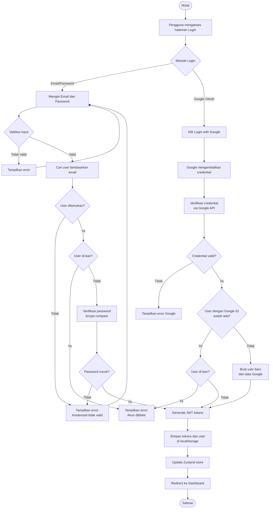

# Activity Diagram — Login

[← Kembali ke Daftar Diagram](../README.md#diagram-uml-file-terpisah)

---

---

### Penjelasan Alur

#### Login via Email/Password
| Langkah | Deskripsi |
|---------|-----------|
| 1 | Pengguna memilih login via email/password |
| 2 | Mengisi email dan password di form |
| 3 | Validasi client-side dan server-side via Zod |
| 4 | Server mencari user berdasarkan email di database |
| 5 | Jika tidak ditemukan, tampilkan error |
| 6 | Cek status ban pengguna |
| 7 | Verifikasi password menggunakan bcrypt compare |
| 8 | Jika cocok, generate JWT tokens |

#### Login via Google OAuth
| Langkah | Deskripsi |
|---------|-----------|
| 1 | Pengguna klik tombol "Login with Google" |
| 2 | Google menampilkan popup dan mengembalikan credential |
| 3 | Backend memverifikasi credential via Google Auth Library |
| 4 | Cek apakah user sudah terdaftar (via Google ID) |
| 5 | Jika belum, buat user baru dari data Google |
| 6 | Cek status ban, lalu generate JWT tokens |

---

[← Kembali ke Daftar Diagram](../README.md#diagram-uml-file-terpisah)
