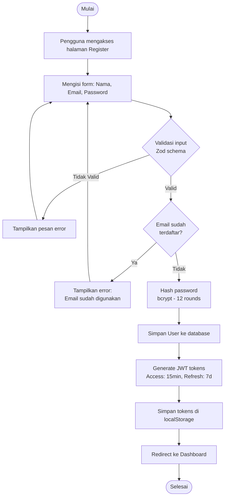

# Activity Diagram — Registrasi

[← Kembali ke Daftar Diagram](../README.md#diagram-uml-file-terpisah)

---

---

### Penjelasan Alur

| Langkah | Deskripsi |
|---------|-----------|
| 1 | Pengguna membuka halaman `/register` |
| 2 | Mengisi formulir registrasi: nama lengkap, alamat email, dan password |
| 3 | Input divalidasi menggunakan Zod schema (shared validators) di client-side dan server-side |
| 4 | Jika validasi gagal, pesan error ditampilkan dan pengguna mengisi ulang |
| 5 | Server memeriksa apakah email sudah digunakan pengguna lain |
| 6 | Jika email duplikat, tampilkan pesan error |
| 7 | Password di-hash menggunakan bcrypt dengan 12 salt rounds |
| 8 | Data User baru disimpan ke database PostgreSQL |
| 9 | Server menggenerate JWT access token (15 menit) dan refresh token (7 hari) |
| 10 | Token disimpan di localStorage browser (`brainforge_tokens`) |
| 11 | Pengguna diarahkan ke halaman Dashboard |

---

[← Kembali ke Daftar Diagram](../README.md#diagram-uml-file-terpisah)
