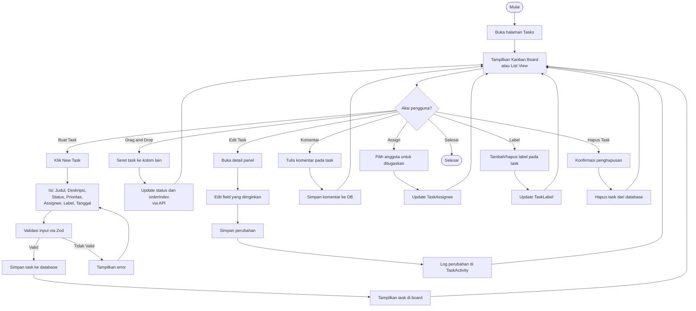

# Activity Diagram — Manajemen Task

[← Kembali ke Daftar Diagram](../README.md#diagram-uml-file-terpisah)

---

---

### Penjelasan Alur

| Aksi | Deskripsi |
|------|-----------|
| **Buat Task** | Pengguna mengklik tombol "New Task", mengisi form (judul, deskripsi, status, prioritas, assignee, label, tanggal), validasi via Zod, dan simpan ke database. |
| **Drag & Drop** | Pengguna menyeret task antar kolom di Kanban board. Status dan urutan (orderIndex) diupdate via API. |
| **Edit Task** | Membuka panel detail task, mengedit field yang diinginkan. Setiap perubahan dicatat di TaskActivity. |
| **Komentar** | Menulis komentar pada task, disimpan sebagai TaskComment. |
| **Assign** | Menugaskan satu atau lebih anggota tim ke task via TaskAssignee. |
| **Label** | Menambahkan atau menghapus label warna pada task melalui relasi TaskLabel. |
| **Hapus** | Menghapus task setelah konfirmasi. |

---

[← Kembali ke Daftar Diagram](../README.md#diagram-uml-file-terpisah)
