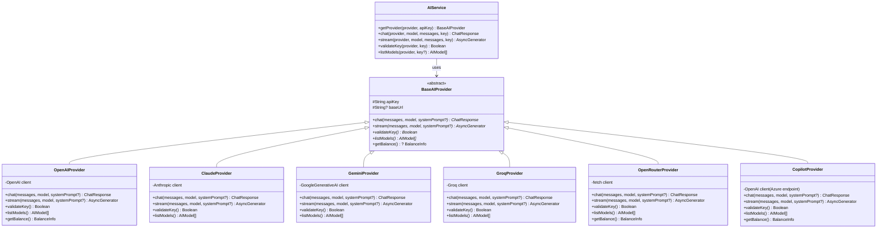

# Class Diagram — AI Provider

[← Kembali ke Daftar Diagram](../README.md#diagram-uml-file-terpisah)

---

---

### Penjelasan

| Class | Deskripsi |
|-------|-----------|
| **BaseAIProvider** | Abstract base class yang mendefinisikan interface untuk semua AI provider. Setiap provider harus mengimplementasikan `chat()`, `stream()`, `validateKey()`, dan `listModels()`. |
| **OpenAIProvider** | Implementasi untuk OpenAI (GPT-4.1, GPT-4o, dll). Menggunakan SDK `openai`. |
| **ClaudeProvider** | Implementasi untuk Anthropic Claude (Sonnet 4, Opus 4, dll). Menggunakan SDK `@anthropic-ai/sdk`. |
| **GeminiProvider** | Implementasi untuk Google Gemini (2.5 Flash, 2.5 Pro, dll). Menggunakan SDK `@google/generative-ai`. |
| **GroqProvider** | Implementasi untuk Groq (Llama 3, Mixtral, dll). Menggunakan SDK `groq-sdk`. |
| **OpenRouterProvider** | Implementasi untuk OpenRouter (400+ model). Menggunakan raw `fetch` dengan API OpenAI-compatible. |
| **CopilotProvider** | Implementasi untuk GitHub Copilot (Azure endpoint). Menggunakan SDK `openai` dengan base URL Azure. |
| **AIService** | Orchestrator yang memilih provider berdasarkan enum dan meneruskan request. Factory pattern. |

---

[← Kembali ke Daftar Diagram](../README.md#diagram-uml-file-terpisah)
