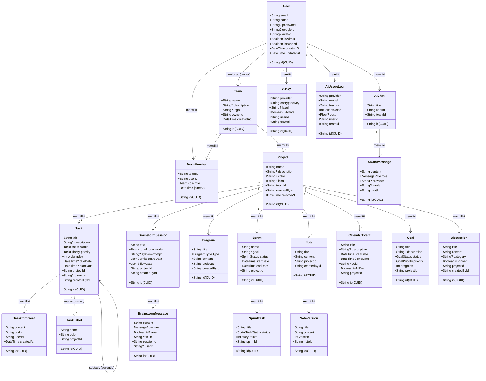

# Class Diagram — Database Entity

[← Kembali ke Daftar Diagram](../README.md#diagram-uml-file-terpisah)

---

> Diagram ini menampilkan model utama beserta atribut dan relasi. Untuk keterbacaan, ditampilkan model-model inti.

---

### Penjelasan

| Model | Deskripsi |
|-------|-----------|
| **User** | Model utama pengguna. Menyimpan kredensial, status admin/ban. |
| **Team** | Tim kerja yang dibuat oleh User (owner). |
| **TeamMember** | Relasi many-to-many User ↔ Team dengan role (OWNER/ADMIN/MEMBER). |
| **Project** | Proyek di bawah team. Container untuk task, brainstorm, diagram, dll. |
| **Task** | Tugas/task dengan status Kanban, prioritas, dan subtask support. |
| **BrainstormSession** | Sesi brainstorm AI dengan whiteboard dan flow data. |
| **BrainstormMessage** | Pesan dalam sesi brainstorm (user atau AI). |
| **Diagram** | Diagram visual (8 tipe: flowchart, sequence, erd, dll). |
| **Sprint** | Sprint planning dengan periode waktu. |
| **SprintTask** | Task di dalam sprint dengan story points. |
| **Note** | Catatan dengan version history support. |
| **CalendarEvent** | Event kalender. |
| **Goal** | Objektif/goal dengan progress tracking. |
| **Discussion** | Thread diskusi dalam proyek. |
| **AiKey** | API key terenkripsi (BYOK) per user per team. |
| **AiUsageLog** | Log penggunaan AI (provider, model, token, cost). |
| **AIChat** | Sesi AI chat mandiri (di luar brainstorm). |
| **AIChatMessage** | Pesan dalam sesi AI chat. |

---

[← Kembali ke Daftar Diagram](../README.md#diagram-uml-file-terpisah)
