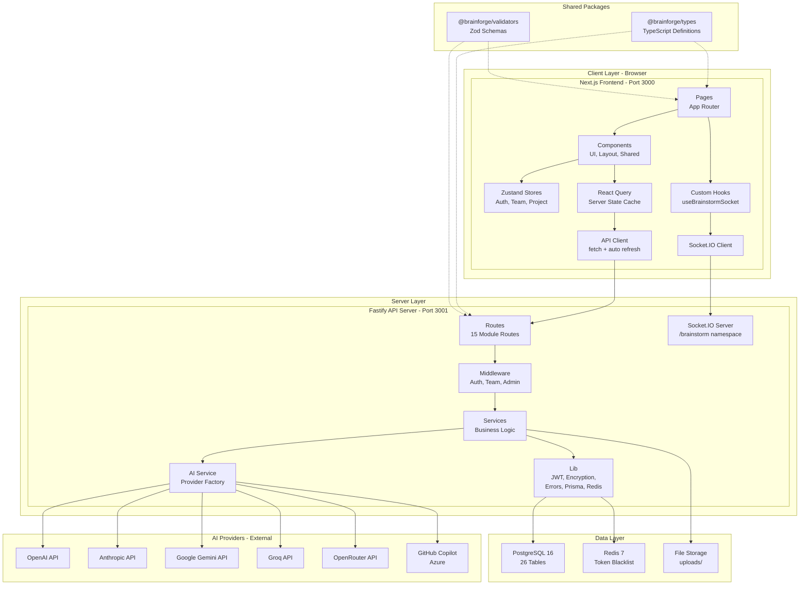

# Component Diagram

[← Kembali ke Daftar Diagram](../README.md#diagram-uml-file-terpisah)

---

---

### Penjelasan Komponen

| Layer | Komponen | Deskripsi |
|-------|----------|-----------|
| **Client** | Pages | Halaman-halaman Next.js (App Router) |
| **Client** | Components | Komponen React (UI primitives, layout, shared) |
| **Client** | Zustand Stores | State management client-side (Auth, Team, Project) |
| **Client** | React Query | Server state cache dan data fetching |
| **Client** | API Client | HTTP client dengan fitur auto token refresh |
| **Client** | Socket.IO Client | Client untuk komunikasi real-time |
| **Server** | Routes | 15 modul route (auth, task, brainstorm, dll.) |
| **Server** | Middleware | Auth guard, team guard, admin guard |
| **Server** | Services | Business logic per modul |
| **Server** | AI Service | Factory pattern untuk memilih AI provider |
| **Server** | Lib | Utility: JWT, encryption, Prisma, Redis, errors |
| **Data** | PostgreSQL | Database relasional utama (26 tabel) |
| **Data** | Redis | Cache untuk token blacklist |
| **Data** | File Storage | Penyimpanan file upload lokal |
| **Shared** | Types | Definisi tipe TypeScript bersama |
| **Shared** | Validators | Schema validasi Zod bersama |

---

[← Kembali ke Daftar Diagram](../README.md#diagram-uml-file-terpisah)
