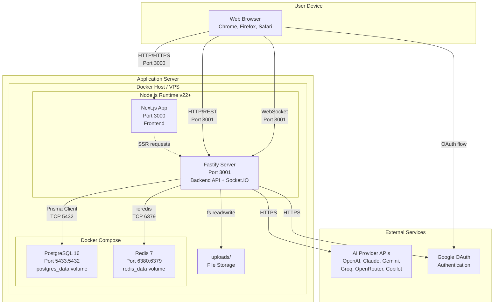

# Deployment Diagram

[← Kembali ke Daftar Diagram](../README.md#diagram-uml-file-terpisah)

---

---

### Penjelasan Node

| Node | Teknologi | Port | Deskripsi |
|------|-----------|------|-----------|
| **Browser** | Chrome/Firefox/Safari | - | Client-side rendering + REST API calls + WebSocket |
| **Next.js App** | Next.js 15 | 3000 | Frontend application dengan SSR capability |
| **Fastify Server** | Fastify 5 + Socket.IO 4 | 3001 | Backend API server + real-time WebSocket server |
| **PostgreSQL** | PostgreSQL 16 Alpine | 5433 (host) → 5432 (container) | Database utama, data persisten via Docker volume |
| **Redis** | Redis 7 Alpine | 6380 (host) → 6379 (container) | Token blacklist, data persisten via Docker volume |
| **File Storage** | Local filesystem | - | Folder `uploads/` untuk file yang diunggah |
| **Google OAuth** | Google API | - | Layanan autentikasi Google |
| **AI Provider APIs** | OpenAI, Anthropic, Google, Groq, OpenRouter | - | Layanan AI eksternal (BYOK) |

---

### Komunikasi Antar Node

| Dari | Ke | Protokol | Deskripsi |
|------|----|----------|-----------|
| Browser | Next.js | HTTP/HTTPS | Memuat halaman web |
| Browser | Fastify | HTTP/REST | API request (CRUD data) |
| Browser | Fastify | WebSocket | Real-time (brainstorm collaboration) |
| Browser | Google | HTTPS | OAuth flow (popup login) |
| Fastify | PostgreSQL | TCP | Query database via Prisma Client |
| Fastify | Redis | TCP | Token blacklist check/set via ioredis |
| Fastify | AI APIs | HTTPS | Request ke AI provider (BYOK keys) |
| Fastify | Google | HTTPS | Verifikasi Google credential |
| Fastify | File Storage | Filesystem | Baca/tulis file upload |

---

[← Kembali ke Daftar Diagram](../README.md#diagram-uml-file-terpisah)
