# Entity Relationship Diagram (ERD)

[← Kembali ke Daftar Diagram](../README.md#diagram-uml-file-terpisah)

---

> Diagram ini menampilkan relasi antar tabel dalam database PostgreSQL (26 model).

```mermaid
erDiagram
    User ||--o{ TeamMember : "has members"
    User ||--o{ Team : "owns"
    User ||--o{ Task : "creates"
    User ||--o{ TaskComment : "writes"
    User ||--o{ TaskAssignee : "assigned to"
    User ||--o{ TaskActivity : "performs"
    User ||--o{ BrainstormSession : "creates"
    User ||--o{ BrainstormMessage : "sends"
    User ||--o{ Diagram : "creates"
    User ||--o{ Note : "creates"
    User ||--o{ Discussion : "creates"
    User ||--o{ DiscussionReply : "writes"
    User ||--o{ AiKey : "owns"
    User ||--o{ AiUsageLog : "logs"
    User ||--o{ AIChat : "owns"
    User ||--o{ Notification : "receives"
    User ||--o{ CalendarEvent : "creates"
    User ||--o{ Goal : "creates"

    Team ||--o{ TeamMember : "has"
    Team ||--o{ Project : "contains"
    Team ||--o{ TeamInvite : "sends"
    Team ||--o{ AiKey : "scoped to"
    Team ||--o{ AiUsageLog : "scoped to"
    Team ||--o{ AIChat : "scoped to"

    Project ||--o{ Task : "contains"
    Project ||--o{ TaskLabel : "has"
    Project ||--o{ BrainstormSession : "contains"
    Project ||--o{ Diagram : "contains"
    Project ||--o{ Sprint : "contains"
    Project ||--o{ Note : "contains"
    Project ||--o{ CalendarEvent : "has"
    Project ||--o{ Goal : "has"
    Project ||--o{ Discussion : "has"

    Task ||--o{ TaskComment : "has"
    Task ||--o{ TaskAssignee : "has"
    Task ||--o{ TaskActivity : "logs"
    Task ||--o{ Task : "subtasks"
    Task }o--o{ TaskLabel : "labeled"
    Task }o--o| Task : "depends on"
    Task }o--o| Sprint : "in sprint"

    BrainstormSession ||--o{ BrainstormMessage : "has"

    Sprint ||--o{ SprintTask : "has"

    Note ||--o{ NoteVersion : "versions"

    Discussion ||--o{ DiscussionReply : "has"

    AIChat ||--o{ AIChatMessage : "has"

    User {
        String id PK
        String email UK
        String name
        String password
        String googleId UK
        String avatar
        Boolean isAdmin
        Boolean isBanned
        DateTime createdAt
        DateTime updatedAt
    }

    Team {
        String id PK
        String name
        String description
        String logo
        String ownerId FK
        DateTime createdAt
    }

    TeamMember {
        String id PK
        String teamId FK
        String userId FK
        TeamRole role
        DateTime joinedAt
    }

    TeamInvite {
        String id PK
        String teamId FK
        String email
        String token UK
        TeamRole role
        InviteStatus status
        DateTime expiresAt
    }

    Project {
        String id PK
        String name
        String description
        String color
        String icon
        String teamId FK
        String createdById FK
    }

    Task {
        String id PK
        String title
        String description
        TaskStatus status
        TaskPriority priority
        Int orderIndex
        DateTime dueDate
        DateTime startDate
        String projectId FK
        String parentId FK
        String createdById FK
        String sprintId FK
    }

    TaskLabel {
        String id PK
        String name
        String color
        String projectId FK
    }

    TaskAssignee {
        String id PK
        String taskId FK
        String userId FK
    }

    TaskComment {
        String id PK
        String content
        String taskId FK
        String userId FK
        DateTime createdAt
    }

    TaskActivity {
        String id PK
        String action
        String field
        String oldValue
        String newValue
        String taskId FK
        String userId FK
    }

    BrainstormSession {
        String id PK
        String title
        BrainstormMode mode
        String systemPrompt
        Json whiteboardData
        Json flowData
        String projectId FK
        String createdById FK
    }

    BrainstormMessage {
        String id PK
        String content
        MessageRole role
        Boolean isPinned
        String fileUrl
        String sessionId FK
        String userId FK
    }

    Diagram {
        String id PK
        String title
        DiagramType type
        String content
        String projectId FK
        String createdById FK
    }

    Sprint {
        String id PK
        String name
        String goal
        SprintStatus status
        DateTime startDate
        DateTime endDate
        String projectId FK
        String createdById FK
    }

    SprintTask {
        String id PK
        String title
        SprintTaskStatus status
        Int storyPoints
        String assignee
        String sprintId FK
    }

    Note {
        String id PK
        String title
        String content
        String projectId FK
        String createdById FK
    }

    NoteVersion {
        String id PK
        String title
        String content
        Int version
        String noteId FK
        String createdById FK
    }

    CalendarEvent {
        String id PK
        String title
        String description
        DateTime startDate
        DateTime endDate
        String color
        Boolean isAllDay
        String projectId FK
        String createdById FK
    }

    Goal {
        String id PK
        String title
        String description
        GoalStatus status
        GoalPriority priority
        Int progress
        DateTime targetDate
        String projectId FK
        String createdById FK
    }

    Discussion {
        String id PK
        String title
        String content
        String category
        Boolean isPinned
        String projectId FK
        String createdById FK
    }

    DiscussionReply {
        String id PK
        String content
        String discussionId FK
        String userId FK
    }

    AiKey {
        String id PK
        String provider
        String encryptedKey
        String label
        Boolean isActive
        String userId FK
        String teamId FK
    }

    AiUsageLog {
        String id PK
        String provider
        String model
        String feature
        Int tokensUsed
        Float cost
        String userId FK
        String teamId FK
    }

    AIChat {
        String id PK
        String title
        String userId FK
        String teamId FK
    }

    AIChatMessage {
        String id PK
        String content
        MessageRole role
        String provider
        String model
        String chatId FK
    }

    Notification {
        String id PK
        String type
        String title
        String message
        Boolean isRead
        String userId FK
        String teamId FK
    }
```

---

### Enum Values

| Enum | Values |
|------|--------|
| **TeamRole** | `OWNER`, `ADMIN`, `MEMBER` |
| **InviteStatus** | `PENDING`, `ACCEPTED`, `EXPIRED` |
| **TaskStatus** | `BACKLOG`, `TODO`, `IN_PROGRESS`, `IN_REVIEW`, `DONE`, `CANCELLED` |
| **TaskPriority** | `LOWEST`, `LOW`, `MEDIUM`, `HIGH`, `HIGHEST` |
| **BrainstormMode** | `BRAINSTORM`, `DEBATE`, `ANALYSIS`, `FREEFORM` |
| **MessageRole** | `USER`, `ASSISTANT` |
| **DiagramType** | `FLOWCHART`, `SEQUENCE`, `CLASS_DIAGRAM`, `ER_DIAGRAM`, `STATE`, `GANTT`, `MINDMAP`, `PIE` |
| **SprintStatus** | `PLANNING`, `ACTIVE`, `COMPLETED` |
| **SprintTaskStatus** | `TODO`, `IN_PROGRESS`, `DONE` |
| **GoalStatus** | `NOT_STARTED`, `IN_PROGRESS`, `COMPLETED`, `CANCELLED` |
| **GoalPriority** | `LOW`, `MEDIUM`, `HIGH` |

---

[← Kembali ke Daftar Diagram](../README.md#diagram-uml-file-terpisah)
