```mermaid
graph TD
    Landing["Landing Page<br/>/"]
    
    subgraph "Auth Pages"
        Login["Login<br/>/login"]
        Register["Register<br/>/register"]
        ForgotPW["Forgot Password<br/>/forgot-password"]
        ResetPW["Reset Password<br/>/reset-password"]
        JoinTeam["Join Team<br/>/join/token"]
    end
    
    subgraph "Main App - Sidebar Layout"
        Dashboard["Dashboard<br/>/dashboard"]
        
        subgraph "Project Management"
            Projects["Projects<br/>/projects"]
            Tasks["Tasks<br/>/tasks"]
            Sprints["Sprints<br/>/sprints"]
            Goals["Goals<br/>/goals"]
            Calendar["Calendar<br/>/calendar"]
        end
        
        subgraph "AI dan Collaboration"
            Brainstorm["Brainstorm<br/>/brainstorm"]
            BrainstormSession["Session Detail<br/>/brainstorm/id"]
            AIChat["AI Chat<br/>/ai-chat"]
            Diagrams["Diagrams<br/>/diagrams"]
            Notes["Notes<br/>/notes"]
        end
        
        subgraph "Communication"
            Notifications["Notifications<br/>/notifications"]
        end
        
        subgraph "Settings"
            GeneralSettings["Settings<br/>/settings"]
            AIKeySettings["AI Keys<br/>/settings/ai-keys"]
            TeamSettings["Team<br/>/settings/team"]
        end
        
        Docs["Docs<br/>/docs"]
    end
    
    subgraph "Admin Panel"
        AdminDashboard["Admin Dashboard<br/>/admin"]
        AdminUsers["Users<br/>/admin/users"]
        AdminTeams["Teams<br/>/admin/teams"]
        AdminActivity["Activity<br/>/admin/activity"]
        AdminAIUsage["AI Usage<br/>/admin/ai-usage"]
        AdminAPIKeys["API Keys<br/>/admin/api-keys"]
        AdminSettings["Settings<br/>/admin/settings"]
        AdminSystem["System<br/>/admin/system"]
    end

    Landing -->|"Login"| Login
    Landing -->|"Register"| Register
    Login -->|"Forgot?"| ForgotPW
    ForgotPW -->|"Reset"| ResetPW
    Login -->|"Success"| Dashboard
    Register -->|"Success"| Dashboard
    JoinTeam -->|"Accepted"| Dashboard
    
    Dashboard --> Projects
    Dashboard --> Tasks
    Dashboard --> Brainstorm
    Dashboard --> Diagrams
    Dashboard --> Sprints
    Dashboard --> Notes
    Dashboard --> Calendar
    Dashboard --> Goals
    Dashboard --> AIChat
    Dashboard --> Notifications
    Dashboard --> GeneralSettings
    Dashboard --> Docs
    
    Brainstorm --> BrainstormSession
    GeneralSettings --> AIKeySettings
    GeneralSettings --> TeamSettings
    
    Dashboard -->|"Admin Only"| AdminDashboard
    AdminDashboard --> AdminUsers
    AdminDashboard --> AdminTeams
    AdminDashboard --> AdminActivity
    AdminDashboard --> AdminAIUsage
    AdminDashboard --> AdminAPIKeys
    AdminDashboard --> AdminSettings
    AdminDashboard --> AdminSystem
```

# Navigation Diagram (Sitemap)

[← Kembali ke Daftar Diagram](../README.md#diagram-uml-file-terpisah)

---

---

### Penjelasan Navigasi

| Area | Akses | Deskripsi |
|------|-------|-----------|
| **Auth Pages** | Publik | Halaman autentikasi: login, register, forgot/reset password, join team via invite link |
| **Main App** | Authenticated | Semua halaman utama aplikasi yang memerlukan login. Ditampilkan dengan layout sidebar. |
| **Project Management** | Authenticated | Modul manajemen proyek: projects, tasks (Kanban), sprints, goals, calendar |
| **AI & Collaboration** | Authenticated | Modul AI dan kolaborasi: brainstorm sessions, AI chat, diagrams, notes |
| **Settings** | Authenticated | Pengaturan: general, AI keys (BYOK), team management |
| **Admin Panel** | Admin only | Panel administrasi: dashboard stats, user management, team overview, AI usage analytics, system settings |

---

[← Kembali ke Daftar Diagram](../README.md#diagram-uml-file-terpisah)
