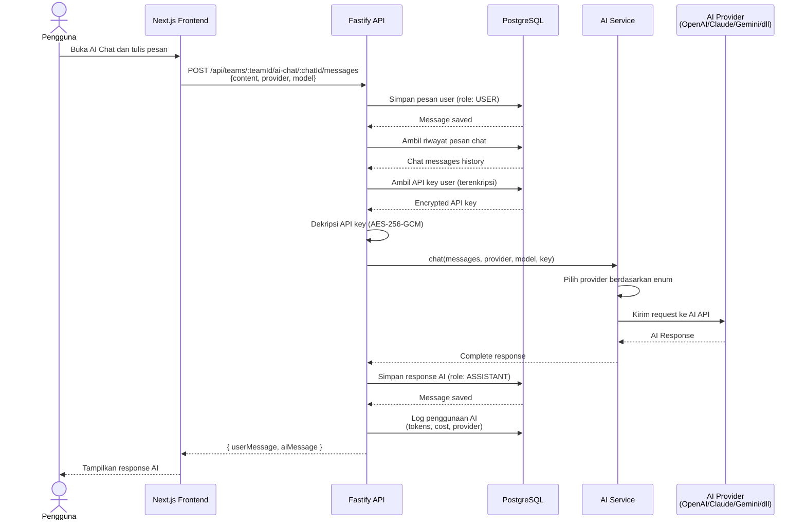

# Sequence Diagram — AI Chat

[← Kembali ke Daftar Diagram](../README.md#diagram-uml-file-terpisah)

---

---

### Penjelasan Alur

| Langkah | Deskripsi |
|---------|-----------|
| 1 | Pengguna menulis pesan di interface AI Chat |
| 2 | Frontend mengirim pesan ke API beserta info provider dan model yang dipilih |
| 3 | API menyimpan pesan user ke database dengan role `USER` |
| 4 | API mengambil riwayat pesan sebelumnya untuk konteks percakapan |
| 5 | API mengambil API key milik pengguna (terenkripsi) dari database |
| 6 | API key didekripsi menggunakan AES-256-GCM |
| 7 | AI Service memilih provider yang sesuai dan mengirim request |
| 8 | Provider AI (OpenAI/Claude/Gemini/dll) memproses dan mengembalikan respons |
| 9 | Respons AI disimpan ke database dengan role `ASSISTANT` |
| 10 | Penggunaan AI di-log (jumlah token, estimasi biaya, provider, model) |
| 11 | Respons dikembalikan ke frontend dan ditampilkan ke pengguna |

---

[← Kembali ke Daftar Diagram](../README.md#diagram-uml-file-terpisah)
