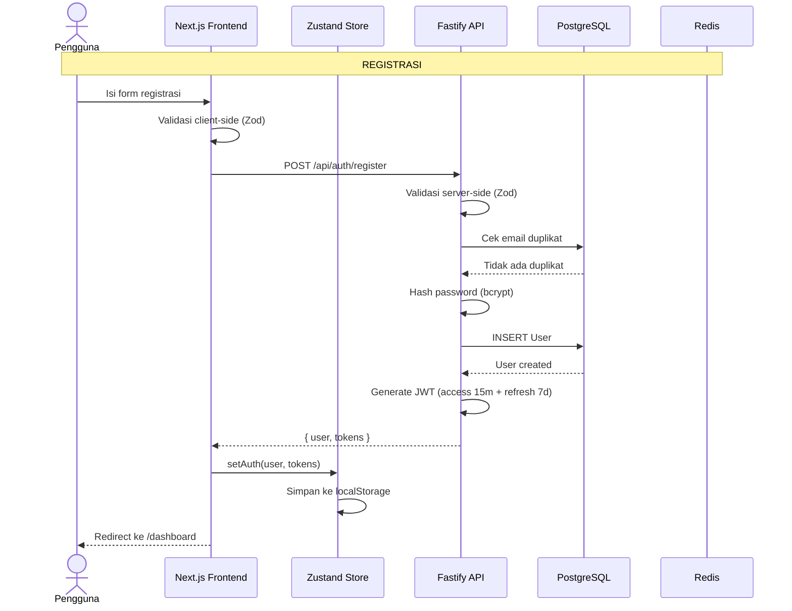
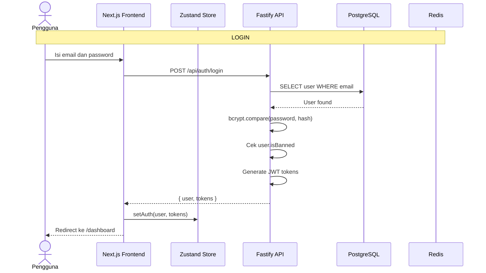
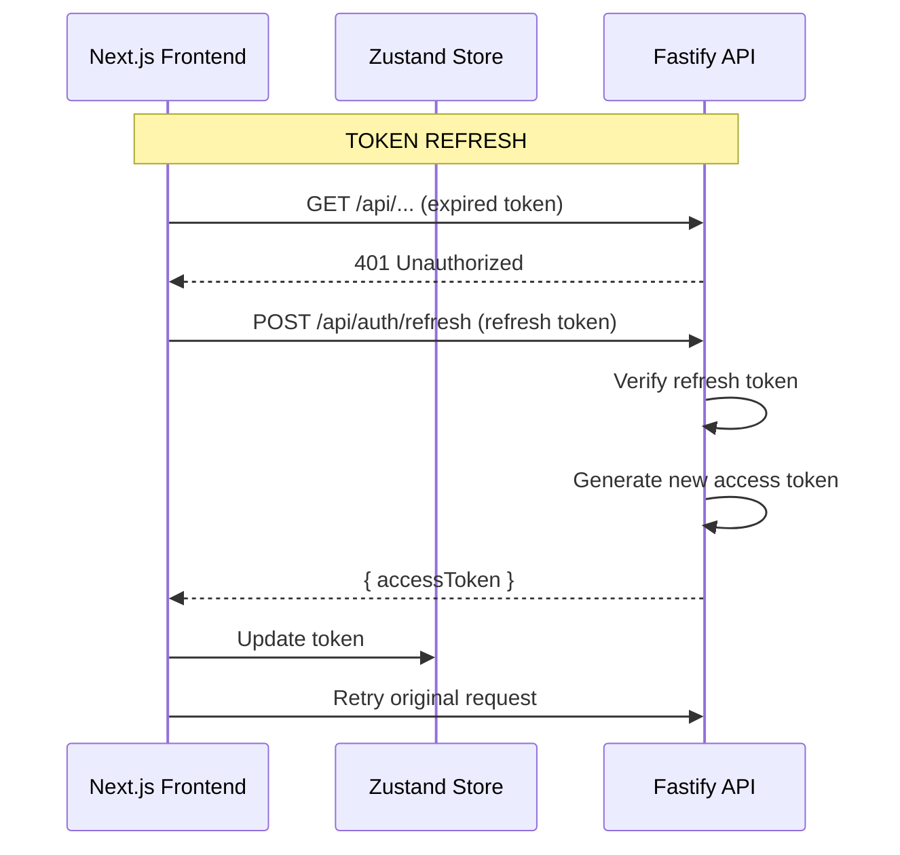
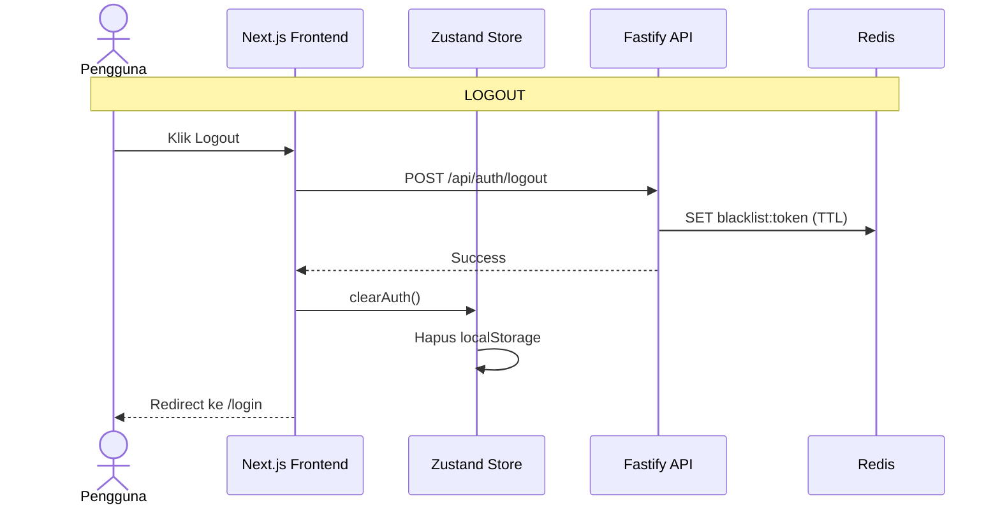

# Sequence Diagram — Autentikasi

[← Kembali ke Daftar Diagram](../README.md#diagram-uml-file-terpisah)

---

---

---

---

---

### Penjelasan

| Alur | Deskripsi |
|------|-----------|
| **Registrasi** | Pengguna mengisi form → validasi ganda (client & server) → cek duplikat email → hash password → simpan user → generate JWT → simpan di client → redirect ke dashboard |
| **Login** | Isi kredensial → cari user di DB → verifikasi password → cek ban status → generate JWT → simpan di client → redirect |
| **Token Refresh** | Request gagal 401 → client kirim refresh token → server verifikasi → generate access token baru → retry original request |
| **Logout** | Klik logout → blacklist token di Redis → hapus data client → redirect ke login |

---

[← Kembali ke Daftar Diagram](../README.md#diagram-uml-file-terpisah)
