# Use Case Diagram

[← Kembali ke Daftar Diagram](../README.md#diagram-uml-file-terpisah)

---

> Render diagram ini di [Mermaid Live Editor](https://mermaid.live) atau platform yang mendukung Mermaid (GitHub, GitLab, VS Code plugin).

```mermaid
graph TB
    subgraph "BrainForge System"
        UC1["Kelola Tugas<br/>CRUD, Assign, Comment,<br/>Label, Dependensi"]
        UC2["Brainstorm AI<br/>Chat, Whiteboard,<br/>Flow Canvas, Upload File"]
        UC3["Kelola Diagram<br/>CRUD, AI Generate"]
        UC4["Sprint Planning<br/>CRUD, AI Generate,<br/>Convert to Tasks"]
        UC5["Kelola Catatan<br/>CRUD, Version History,<br/>AI Assist"]
        UC6["Kelola Kalender<br/>CRUD Event, Feed"]
        UC7["Goal Tracking<br/>CRUD, AI Generate<br/>SMART Goals"]
        UC8["Diskusi<br/>Thread, Reply,<br/>Pin, Kategori"]
        UC9["AI Chat<br/>Chat Mandiri,<br/>Multi-Provider"]
        UC10["Kelola AI Key<br/>BYOK, Validate,<br/>Check Balance"]
        UC11["Kelola Tim<br/>CRUD, Invite,<br/>Role Management"]
        UC12["Kelola Proyek<br/>CRUD, Members,<br/>Colors dan Icons"]
        UC13["Autentikasi<br/>Register, Login,<br/>Google OAuth, Reset PW"]
        UC14["Notifikasi<br/>View, Mark Read,<br/>Delete"]
        UC15["AI Generate<br/>Bulk Generation:<br/>Tasks+Notes+Goals"]
    end

    subgraph "Admin Features"
        UC16["Dashboard Admin<br/>Stats, Growth"]
        UC17["Kelola Pengguna<br/>Ban, Admin Toggle,<br/>Reset Password"]
        UC18["Analitik AI<br/>Usage Logs, Cost"]
        UC19["System Settings<br/>Config per Kategori"]
    end

    User["User<br/>Pengguna"]
    Admin["Admin<br/>Administrator"]

    User --> UC1
    User --> UC2
    User --> UC3
    User --> UC4
    User --> UC5
    User --> UC6
    User --> UC7
    User --> UC8
    User --> UC9
    User --> UC10
    User --> UC11
    User --> UC12
    User --> UC13
    User --> UC14
    User --> UC15

    Admin --> UC16
    Admin --> UC17
    Admin --> UC18
    Admin --> UC19
    Admin --> UC1
    Admin --> UC2
    Admin --> UC3
```

---

### Deskripsi Aktor

| Aktor | Deskripsi |
|-------|-----------|
| **User (Pengguna)** | Pengguna terdaftar yang dapat mengakses semua fitur utama aplikasi setelah autentikasi. |
| **Admin (Administrator)** | Pengguna dengan hak admin yang dapat mengakses panel administrasi untuk mengelola pengguna, tim, dan pengaturan sistem. Admin juga memiliki semua hak akses User. |

### Deskripsi Use Case

| No | Use Case | Deskripsi |
|----|----------|-----------|
| UC1 | Kelola Tugas | Membuat, membaca, mengupdate, menghapus tugas. Menugaskan anggota, menambah komentar, mengelola label, mengatur dependensi antar tugas. |
| UC2 | Brainstorm AI | Membuat sesi brainstorm, mengirim pesan dan mendapat respons AI, menggunakan whiteboard dan flow canvas secara kolaboratif, mengunggah file. |
| UC3 | Kelola Diagram | Membuat dan mengedit diagram visual (8 tipe), menggunakan AI untuk generate diagram otomatis dari deskripsi. |
| UC4 | Sprint Planning | Membuat dan mengelola sprint, menggunakan AI untuk generate rencana sprint, mengkonversi task sprint menjadi task nyata. |
| UC5 | Kelola Catatan | Membuat dan mengedit catatan, menggunakan AI untuk expand/summarize, melihat dan merestore versi sebelumnya. |
| UC6 | Kelola Kalender | Membuat event, melihat kalender terintegrasi dengan tenggat tugas dan milestone sprint. |
| UC7 | Goal Tracking | Membuat dan melacak objektif, menggunakan AI untuk generate SMART goals. |
| UC8 | Diskusi | Membuat thread diskusi, membalas, menyematkan, mengkategorikan diskusi. |
| UC9 | AI Chat | Berbicara dengan AI assistant dengan riwayat percakapan tersimpan. |
| UC10 | Kelola AI Key | Menambah, memvalidasi, dan mengelola API key AI (BYOK). |
| UC11 | Kelola Tim | Membuat tim, mengundang anggota, mengelola role (Owner/Admin/Member). |
| UC12 | Kelola Proyek | Membuat proyek, mengelola anggota proyek, kustomisasi warna dan ikon. |
| UC13 | Autentikasi | Registrasi, login (email/password & Google OAuth), logout, reset password, hubungkan/lepas akun Google. |
| UC14 | Notifikasi | Melihat notifikasi, menandai telah dibaca, menghapus notifikasi. |
| UC15 | AI Generate | Bulk generation: membuat tasks, brainstorm, notes, dan goals dari satu prompt. |
| UC16 | Dashboard Admin | Melihat statistik sistem (pengguna, tim, tugas) dan analitik pertumbuhan. |
| UC17 | Kelola Pengguna | Melihat daftar pengguna, ban/unban, toggle admin, reset password. |
| UC18 | Analitik AI | Melihat statistik penggunaan AI (log, cost, provider). |
| UC19 | System Settings | Mengelola pengaturan sistem per kategori. |

---

[← Kembali ke Daftar Diagram](../README.md#diagram-uml-file-terpisah)
